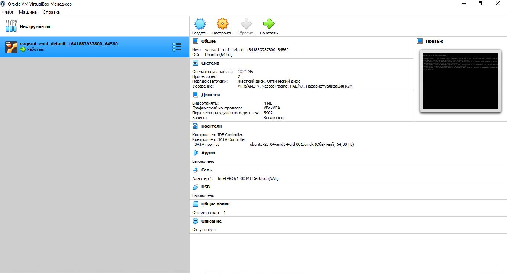

### 5.

- Выделенные аппаратные ресурсы:



- Выделенные аппаратные ресурсы по умолчанию: 

Ресурсы по умолчанию выделяются исходя box.ovf файла 
который скачивается при ```vagrant add <box>``` или ```vagrant init <box>```:

```xml

<?xml version="1.0"?>
<Envelope ovf:version="1.0" xml:lang="en-US" xmlns="http://schemas.dmtf.org/ovf/envelope/1" xmlns:ovf="http://schemas.dmtf.org/ovf/envelope/1" xmlns:rasd="http://schemas.dmtf.org/wbem/wscim/1/cim-schema/2/CIM_ResourceAllocationSettingData" xmlns:vssd="http://schemas.dmtf.org/wbem/wscim/1/cim-schema/2/CIM_VirtualSystemSettingData" xmlns:xsi="http://www.w3.org/2001/XMLSchema-instance" xmlns:vbox="http://www.virtualbox.org/ovf/machine">
  <References>
    <File ovf:id="file1" ovf:href="ubuntu-20.04-amd64-disk001.vmdk"/>
  </References>
  <DiskSection>
    <Info>List of the virtual disks used in the package</Info>
    <Disk ovf:capacity="68719476736" ovf:diskId="vmdisk1" ovf:fileRef="file1" ovf:format="http://www.vmware.com/interfaces/specifications/vmdk.html#streamOptimized" vbox:uuid="9cacebb5-d4cd-45ec-afcd-98d0ad7281b2"/>
  </DiskSection>
  <NetworkSection>
    <Info>Logical networks used in the package</Info>
    <Network ovf:name="NAT">
      <Description>Logical network used by this appliance.</Description>
    </Network>
  </NetworkSection>
  <VirtualSystem ovf:id="ubuntu-20.04-amd64">
    <Info>A virtual machine</Info>
    <OperatingSystemSection ovf:id="94">
      <Info>The kind of installed guest operating system</Info>
      <Description>Ubuntu_64</Description>
      <vbox:OSType ovf:required="false">Ubuntu_64</vbox:OSType>
    </OperatingSystemSection>
    <VirtualHardwareSection>
      <Info>Virtual hardware requirements for a virtual machine</Info>
      <System>
        <vssd:ElementName>Virtual Hardware Family</vssd:ElementName>
        <vssd:InstanceID>0</vssd:InstanceID>
        <vssd:VirtualSystemIdentifier>ubuntu-20.04-amd64</vssd:VirtualSystemIdentifier>
        <vssd:VirtualSystemType>virtualbox-2.2</vssd:VirtualSystemType>
      </System>
      <Item>
        <rasd:Caption>2 virtual CPU</rasd:Caption>
        <rasd:Description>Number of virtual CPUs</rasd:Description>
        <rasd:ElementName>2 virtual CPU</rasd:ElementName>
        <rasd:InstanceID>1</rasd:InstanceID>
        <rasd:ResourceType>3</rasd:ResourceType>
        <rasd:VirtualQuantity>2</rasd:VirtualQuantity>
      </Item>
      <Item>
        <rasd:AllocationUnits>MegaBytes</rasd:AllocationUnits>
        <rasd:Caption>1024 MB of memory</rasd:Caption>
        <rasd:Description>Memory Size</rasd:Description>
        <rasd:ElementName>1024 MB of memory</rasd:ElementName>
        <rasd:InstanceID>2</rasd:InstanceID>
        <rasd:ResourceType>4</rasd:ResourceType>
        <rasd:VirtualQuantity>1024</rasd:VirtualQuantity>
      </Item>
      <Item>
        <rasd:Address>0</rasd:Address>
        <rasd:Caption>ideController0</rasd:Caption>
        <rasd:Description>IDE Controller</rasd:Description>
        <rasd:ElementName>ideController0</rasd:ElementName>
        <rasd:InstanceID>3</rasd:InstanceID>
        <rasd:ResourceSubType>PIIX4</rasd:ResourceSubType>
        <rasd:ResourceType>5</rasd:ResourceType>
      </Item>
      <Item>
        <rasd:Address>1</rasd:Address>
        <rasd:Caption>ideController1</rasd:Caption>
        <rasd:Description>IDE Controller</rasd:Description>
        <rasd:ElementName>ideController1</rasd:ElementName>
        <rasd:InstanceID>4</rasd:InstanceID>
        <rasd:ResourceSubType>PIIX4</rasd:ResourceSubType>
        <rasd:ResourceType>5</rasd:ResourceType>
      </Item>
      <Item>
        <rasd:Address>0</rasd:Address>
        <rasd:Caption>sataController0</rasd:Caption>
        <rasd:Description>SATA Controller</rasd:Description>
        <rasd:ElementName>sataController0</rasd:ElementName>
        <rasd:InstanceID>5</rasd:InstanceID>
        <rasd:ResourceSubType>AHCI</rasd:ResourceSubType>
        <rasd:ResourceType>20</rasd:ResourceType>
      </Item>
      <Item>
        <rasd:AddressOnParent>0</rasd:AddressOnParent>
        <rasd:Caption>disk1</rasd:Caption>
        <rasd:Description>Disk Image</rasd:Description>
        <rasd:ElementName>disk1</rasd:ElementName>
        <rasd:HostResource>/disk/vmdisk1</rasd:HostResource>
        <rasd:InstanceID>6</rasd:InstanceID>
        <rasd:Parent>5</rasd:Parent>
        <rasd:ResourceType>17</rasd:ResourceType>
      </Item>
      <Item>
        <rasd:AutomaticAllocation>true</rasd:AutomaticAllocation>
        <rasd:Caption>Ethernet adapter on 'NAT'</rasd:Caption>
        <rasd:Connection>NAT</rasd:Connection>
        <rasd:ElementName>Ethernet adapter on 'NAT'</rasd:ElementName>
        <rasd:InstanceID>7</rasd:InstanceID>
        <rasd:ResourceSubType>E1000</rasd:ResourceSubType>
        <rasd:ResourceType>10</rasd:ResourceType>
      </Item>
    </VirtualHardwareSection>
    <vbox:Machine ovf:required="false" version="1.16-macosx" uuid="{aafc3e24-c659-4332-b081-e02fe33be53f}" name="ubuntu-20.04-amd64" OSType="Ubuntu_64" snapshotFolder="Snapshots" lastStateChange="2021-12-19T19:46:28Z">
      <ovf:Info>Complete VirtualBox machine configuration in VirtualBox format</ovf:Info>
      <Hardware>
        <CPU count="2">
          <PAE enabled="true"/>
          <LongMode enabled="true"/>
          <X2APIC enabled="true"/>
          <HardwareVirtExLargePages enabled="true"/>
        </CPU>
        <Memory RAMSize="1024"/>
        <Boot>
          <Order position="1" device="HardDisk"/>
          <Order position="2" device="DVD"/>
          <Order position="3" device="None"/>
          <Order position="4" device="None"/>
        </Boot>
        <Display VRAMSize="4"/>
        <VideoCapture file="." fps="25"/>
        <RemoteDisplay enabled="true">
          <VRDEProperties>
            <Property name="TCP/Address" value="127.0.0.1"/>
            <Property name="TCP/Ports" value="5902"/>
          </VRDEProperties>
        </RemoteDisplay>
        <BIOS>
          <IOAPIC enabled="true"/>
          <SmbiosUuidLittleEndian enabled="true"/>
        </BIOS>
        <Network>
          <Adapter slot="0" enabled="true" MACAddress="080027B1285D" type="82540EM">
            <NAT/>
          </Adapter>
        </Network>
        <AudioAdapter driver="CoreAudio" enabledIn="false" enabledOut="false"/>
        <Clipboard/>
      </Hardware>
      <StorageControllers>
        <StorageController name="IDE Controller" type="PIIX4" PortCount="2" useHostIOCache="true" Bootable="true"/>
        <StorageController name="SATA Controller" type="AHCI" PortCount="1" useHostIOCache="false" Bootable="true" IDE0MasterEmulationPort="0" IDE0SlaveEmulationPort="1" IDE1MasterEmulationPort="2" IDE1SlaveEmulationPort="3">
          <AttachedDevice type="HardDisk" hotpluggable="false" port="0" device="0">
            <Image uuid="{9cacebb5-d4cd-45ec-afcd-98d0ad7281b2}"/>
          </AttachedDevice>
        </StorageController>
      </StorageControllers>
    </vbox:Machine>
  </VirtualSystem>
</Envelope>

```
### 6. Для того чтобы добавить RAM и CPU виртуальной машине нужно добавить следующие строчки в Vargantfile:

```bash
config.vm.provider "virtualbox" do |v|
  v.memory = 1024
  v.cpus = 2
end
```
Затем необходимо выполнить команду ```vagrant reload``` 
для того что-бы рестартовать вирт. машину и перечитать Vargantfile.

### 8.

- Длину журнала history можно задать переменной ```HISTFILESIZE```(строка 1200)
- ```ignoreboth``` - это сокращение от  ```ignorespace``` и ```ignoredups```

```ignorespace``` - не сохранять строки начинающиеся с символа ```<пробел>```

```ignoredups``` -  не сохранять строки совпадающие с последней выполненной командой

### 9.

```{}```  - Используются для сокращения\генерации записи с общим префиксом

Например:

```bash
mkdir /usr/local/src/bash/{old,new,dist,bugs}
```
Создаст 4 каталога(слева - направо) 
```
/usr/local/src/bash/old
/usr/local/src/bash/new
/usr/local/src/bash/dist
/usr/local/src/bash/bugs
```
Без конструкции с ```{}``` пришлось бы 4 раза указать 
полный путь ```/usr/local/src/bash/```

Описание ```{}``` находится на строке ```1091```


### 10.

Для того что-бы создать 100000 файлов однократным вызовом ```touch```, 
нужно выполнить следующую команду:

```touch file{1..100000}```


```touch file{1..300000}``` - выводит следующую ошибку ```bash: /bin/touch: Argument list too long```

Это происходит из-за лимита в переменной ```ARG_MAX```. Лимит на длинну аргумента переданного команде.
Данное поведение можно обойти с помощью ```ulimit -s 65536```
### 11.

```[[ -d /tmp ]]``` - Возвращает истину *(0)* если каталог ```/tmp``` существует

### 12.

```bash
mkdir /tmp/new_path_directory/
sudo cp $SHELL /tmp/new_path_directory/bash
sudo cp $SHELL /usr/local/bin/bash
export PATH=/tmp/new_path_directory:/usr/local/sbin:/usr/local/bin:/usr/sbin:/bin:/usr/bin:/sbin:/usr/games:/usr/local/games:/snap/bin
```

### 13.

```at``` - выполняет одноразовое задание в назчаненное время
```batch``` - выполняет одноразовое задание когда достигнут определенный *(в меньшую сторону)* уровень загрузки системы
