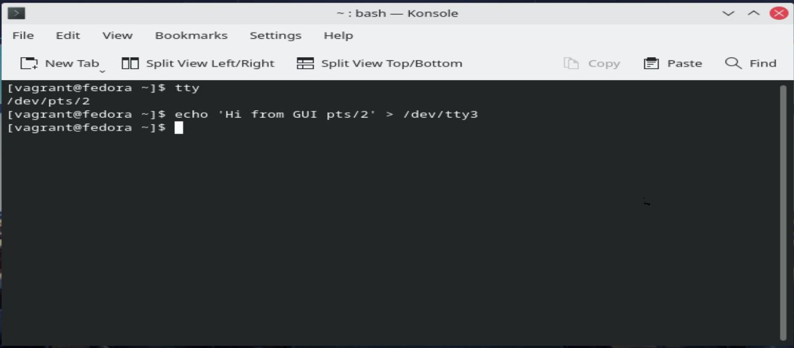

##### 1. Какого типа команда `cd`? Попробуйте объяснить, почему она именно такого типа; опишите ход своих мыслей, если считаете что она могла бы быть другого типа.

###### Ответ: 
```bash
vagrant@vagrant:~$ type cd
cd is a shell builtin
```
```builtin cd``` - выполняется внутри самого bash, вместо того что-бы
создавать отедельный процесс(отдельную среду), отдельный процесс не сможет
поменять директорию внутри bash, который его вызвал.

P.S. Текущая директория уникальна для каждого процесса.

##### 2. Какая альтернатива без pipe команде `grep <some_string> <some_file> | wc -l`? `man grep` поможет в ответе на этот вопрос. Ознакомьтесь с [документом](http://www.smallo.ruhr.de/award.html) о других подобных некорректных вариантах использования pipe.
###### Ответ: 
```bash
vagrant@vagrant:/$ grep -c UseDNS /etc/ssh/sshd_config
2

```


##### 3. Какой процесс с PID `1` является родителем для всех процессов в вашей виртуальной машине Ubuntu 20.04?
###### Ответ:
Процесс ```systemd``` является родителем для всех процессов.

```bash
vagrant@vagrant:/$ pstree -g
systemd(1)─┬─VBoxService(867)─┬─{VBoxService}(867)
           │                  ├─{VBoxService}(867)
           │                  ├─{VBoxService}(867)
           │                  ├─{VBoxService}(867)
           │                  ├─{VBoxService}(867)
           │                  ├─{VBoxService}(867)
           │                  ├─{VBoxService}(867)
           │                  └─{VBoxService}(867)
           ├─accounts-daemon(650)─┬─{accounts-daemon}(650)


```

#### 4. Как будет выглядеть команда, которая перенаправит вывод stderr `ls` на другую сессию терминала?
###### Ответ:
```ls -l /test.txt 2>/dev/pts/1```

#### 5. Получится ли одновременно передать команде файл на stdin и вывести ее stdout в другой файл? Приведите работающий пример.

###### Ответ:
```cat < somefile.txt > anotherfile.txt```

#### 6. Получится ли находясь в графическом режиме, вывести данные из PTY в какой-либо из эмуляторов TTY? Сможете ли вы наблюдать выводимые данные?
###### Ответ:
Поучится.



#### 7. Выполните команду `bash 5>&1`. К чему она приведет? Что будет, если вы выполните `echo netology > /proc/$$/fd/5`? Почему так происходит?

###### Ответ:

При выполнении команды ```bash 5>&1``` создается новый дескриптор, 
который перенаправляет в stdout ```5 -> /dev/pts/0```:

```bash
vagrant@vagrant:/tmp$ ls -l /proc/$$/fd/
total 0
lrwx------ 1 vagrant vagrant 64 Jan 17 19:46 0 -> /dev/pts/0
lrwx------ 1 vagrant vagrant 64 Jan 17 19:46 1 -> /dev/pts/0
lrwx------ 1 vagrant vagrant 64 Jan 17 19:46 2 -> /dev/pts/0
lrwx------ 1 vagrant vagrant 64 Jan 17 19:46 255 -> /dev/pts/0
lrwx------ 1 vagrant vagrant 64 Jan 17 19:46 5 -> /dev/pts/0
lrwx------ 1 vagrant vagrant 64 Jan 17 19:46 7 -> /dev/pts/0
[11]+  Done                    echo
```
Так как мы перенаправляем ```echo netology > /proc/$$/fd/5``` в дескриптор  
который смотри в stdout текущего процесса ```5 -> /dev/pts/0```

Получаем следующий результат:

```bash
vagrant@vagrant:/tmp$ echo netology > /proc/$$/fd/5
netology
```
#### 8. Получится ли в качестве входного потока для pipe использовать только stderr команды, не потеряв при этом отображение stdout на pty? Напоминаем: по умолчанию через pipe передается только stdout команды слева от `|` на stdin команды справа. Это можно сделать, поменяв стандартные потоки местами через промежуточный новый дескриптор, который вы научились создавать в предыдущем вопросе.
###### Ответ:
Что-бы получить `stderr` в качестве входного потока(без промежуточного дескриптора) для команды стоящей справа от `|`:

```bash
vagrant@vagrant:/tmp$ cat /tmp/file2.txt 2>&1 | wc -m
47
```
Без перенаправления:
```bash
vagrant@vagrant:~$ cat /tmp/file2.txt | wc -m
cat: /tmp/file2.txt: No such file or directory
0
```

#### 9. Что выведет команда `cat /proc/$$/environ`? Как еще можно получить аналогичный по содержанию вывод?
###### Ответ:
Команда `cat /proc/$$/environ` выведет переменные окружения текущего процесса: 
```bash
vagrant@vagrant:~$ cat /proc/$$/environ
USER=vagrantLOGNAME=vagrantHOME=/home/vagrantPATH=/usr/local/sbin:/usr/local/bin:/usr/sbin:/usr/bin:/sbin:/bin:/usr/games:/usr/local/games:/snap/binSHELL=/bin/bashTERM=xtermXDG_SESSION_ID=3XDG_RUNTIME_DIR=/run/user/1000DBUS_SESSION_BUS_ADDRESS=unix:path=/run/user/1000/busXDG_SESSION_TYPE=ttyXDG_SESSION_CLASS=userMOTD_SHOWN=pamLANG=en_US.UTF-8SSH_CLIENT=10.0.2.2 19065 22SSH_CONNECTION=10.0.2.2 19065 10.0.2.15 22SSH_TTY=/dev/pts/1vagrant@vagrant:~$
vagrant@vagrant:~$

```
Аналогичный по содержанию вывод можно получить с помощью `env` и `printenv`.

#### 10. Используя `man`, опишите что доступно по адресам `/proc/<PID>/cmdline`, `/proc/<PID>/exe`.
###### Ответ:

`/proc/<PID>/cmdline` - файл является `ro` и содержит полную команду для текущего процесса, 
до тех пор пока процесс не станет зомби.

`/proc/<PID>/exe` - данный файл является символической ссылкой, ктороая указывает на исполняемый файл
текущего процесса.

#### 11. Узнайте, какую наиболее старшую версию набора инструкций SSE поддерживает ваш процессор с помощью `/proc/cpuinfo`.
###### Ответ:

`sse4_2`

#### 12. При открытии нового окна терминала и `vagrant ssh` создается новая сессия и выделяется pty. Это можно подтвердить командой `tty`, которая упоминалась в лекции 3.2. Однако:

    ```bash
	vagrant@netology1:~$ ssh localhost 'tty'
	not a tty
    ```

	Почитайте, почему так происходит, и как изменить поведение.
###### Ответ:

По умолчанию при выполнении удаленной команды через `ssh localhost 'tty'`TTY не выделяется.

Если необходимо выделить TTY нужно запустить `ssh` с клчом `-t`
```
     -t      Force pseudo-terminal allocation.  This can be used to execute
             arbitrary screen-based programs on a remote machine, which can be
             very useful, e.g. when implementing menu services.  Multiple -t
             options force tty allocation, even if ssh has no local tty.
```
```bash
vagrant@vagrant:~$ ssh -t  localhost 'tty'
vagrant@localhost's password:
/dev/pts/0
Connection to localhost closed.
```
P.S. ***Было бы здорово получить более развернутый ответ или ссылку где можно почитать.***

Так происходит потому что п
#### 13. Бывает, что есть необходимость переместить запущенный процесс из одной сессии в другую. Попробуйте сделать это, воспользовавшись `reptyr`. Например, так можно перенести в `screen` процесс, который вы запустили по ошибке в обычной SSH-сессии.
###### Ответ:
Например можно запустить в терминале `sleep 1h`, создать новное ssh 
соединение и запустить `screen` и `ps -a`

```bash
vagrant@vagrant:~$ ps -a
    PID TTY          TIME CMD
   1379 pts/2    00:00:00 sleep
   1380 pts/1    00:00:00 screen
   1389 pts/3    00:00:00 ps
```
Далее запустить `sudo reptyr -T 1379`
Теперь процесс перенесен в `screen` другой сесии.


#### 14. `sudo echo string > /root/new_file` не даст выполнить перенаправление под обычным пользователем, так как перенаправлением занимается процесс shell'а, который запущен без `sudo` под вашим пользователем. Для решения данной проблемы можно использовать конструкцию `echo string | sudo tee /root/new_file`. Узнайте что делает команда `tee` и почему в отличие от `sudo echo` команда с `sudo tee` будет работать.
###### Ответ:
`tee` - читает из `stdin` и пишет в `stdout` и файлы.

В случае `echo string | sudo tee /root/new_file` мы вначале вызываем `echo string` затем через `pipe` 
предаем `stdout` команде `tee` запущенной с привилегированными правами.
