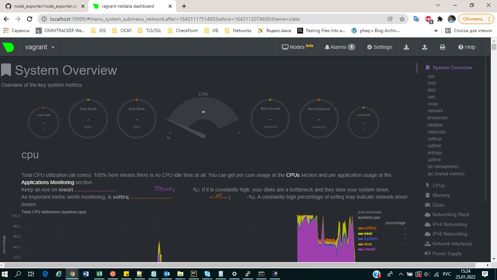

##### 1. На лекции мы познакомились с [node_exporter](https://github.com/prometheus/node_exporter/releases). В демонстрации его исполняемый файл запускался в background. Этого достаточно для демо, но не для настоящей production-системы, где процессы должны находиться под внешним управлением. Используя знания из лекции по systemd, создайте самостоятельно простой [unit-файл](https://www.freedesktop.org/software/systemd/man/systemd.service.html) для node_exporter:

* поместите его в автозагрузку,
* предусмотрите возможность добавления опций к запускаемому процессу через внешний файл (посмотрите, например, на `systemctl cat cron`),
* удостоверьтесь, что с помощью systemctl процесс корректно стартует, завершается, а после перезагрузки автоматически поднимается.
###### Ответ:
Добавление сервиса в автозагрузку:

`systemctl enable nodexp.service`

Для добавления опций к запускаемому процессу необходимо через ключ `EnvironmentFile` указать расположение файла
в ктором будут храниться переменные и передать их systemd:
```
[Unit]
Description=NodeExporterUnit

[Service]
EnvironmentFile=/etc/nodexp.conf
ExecStart=/usr/local/sbin/node_exporter $OPT1 $OPT2
Restart=on-failure


[Install]
WantedBy=multi-user.target
```

```bash
root@vagrant:/etc# cat /etc/nodexp.conf
OPT1=--collector.ethtool
OPT2=--collector.processes
```
Запуск, остановка:
```bash
root@vagrant:/etc# systemctl start nodexp
root@vagrant:/etc# echo $?
0
root@vagrant:/etc# systemctl stop nodexp
root@vagrant:/etc# echo $?
0
```
Автозапуск(тут мы как раз видим переданные опции):
```bash
vagrant@vagrant:~$ systemctl status nodexp
● nodexp.service - NodeExporterUnit
     Loaded: loaded (/etc/systemd/system/nodexp.service; enabled; vendor preset: enabled)
     Active: active (running) since Sat 2022-01-22 13:12:44 UTC; 2 days ago
   Main PID: 694 (node_exporter)
      Tasks: 4 (limit: 4647)
     Memory: 14.5M
     CGroup: /system.slice/nodexp.service
             └─694 /usr/local/sbin/node_exporter --collector.ethtool --collector.processes

Jan 22 13:12:59 vagrant node_exporter[694]: ts=2022-01-22T13:12:59.052Z caller=node_exporter.go:115 level=info collector=thermal_zone
Jan 22 13:12:59 vagrant node_exporter[694]: ts=2022-01-22T13:12:59.052Z caller=node_exporter.go:115 level=info collector=time
Jan 22 13:12:59 vagrant node_exporter[694]: ts=2022-01-22T13:12:59.052Z caller=node_exporter.go:115 level=info collector=timex
Jan 22 13:12:59 vagrant node_exporter[694]: ts=2022-01-22T13:12:59.052Z caller=node_exporter.go:115 level=info collector=udp_queues
Jan 22 13:12:59 vagrant node_exporter[694]: ts=2022-01-22T13:12:59.052Z caller=node_exporter.go:115 level=info collector=uname
Jan 22 13:12:59 vagrant node_exporter[694]: ts=2022-01-22T13:12:59.052Z caller=node_exporter.go:115 level=info collector=vmstat
Jan 22 13:12:59 vagrant node_exporter[694]: ts=2022-01-22T13:12:59.052Z caller=node_exporter.go:115 level=info collector=xfs
Jan 22 13:12:59 vagrant node_exporter[694]: ts=2022-01-22T13:12:59.052Z caller=node_exporter.go:115 level=info collector=zfs
Jan 22 13:12:59 vagrant node_exporter[694]: ts=2022-01-22T13:12:59.052Z caller=node_exporter.go:199 level=info msg="Listening on" address=:9100
Jan 22 13:12:59 vagrant node_exporter[694]: ts=2022-01-22T13:12:59.054Z caller=tls_config.go:195 level=info msg="TLS is disabled." http2=false

```

##### 2. Ознакомьтесь с опциями node_exporter и выводом `/metrics` по-умолчанию. Приведите несколько опций, которые вы бы выбрали для базового мониторинга хоста по CPU, памяти, диску и сети.
###### Ответ:
Для базового!(ключевое слово) мониторинга хоста выбрал бы следующие коллекторы:

 * 1ым делом выключил бы неинтересующие метрики, чтоб не отвлекали: 

`--collector.disable-defaults`
 * Базовый мониторинг CPU: 

`--collector.cpu`

* Базовый мониторинг RAM: 

`--collector.meminfo`

* Базовый мониторинг дисковой подсистемы: 

`--collector.filesystem`

* Базовый мониторинг сетевой подсистемы: 

`--collector.netdev`

Далее через файл описанный выше `/etc/nodexp.conf` добавить вышеописанные коллекторы
и перезагрузить unit `systemctl restart nodexp.service`


##### 3. Установите в свою виртуальную машину [Netdata](https://github.com/netdata/netdata). Воспользуйтесь [готовыми пакетами](https://packagecloud.io/netdata/netdata/install) для установки (`sudo apt install -y netdata`). После успешной установки:
* в конфигурационном файле `/etc/netdata/netdata.conf` в секции [web] замените значение с localhost на `bind to = 0.0.0.0`,
* добавьте в Vagrantfile проброс порта Netdata на свой локальный компьютер и сделайте `vagrant reload`:

```bash
config.vm.network "forwarded_port", guest: 19999, host: 19999
```

После успешной перезагрузки в браузере *на своем ПК* (не в виртуальной машине) вы должны суметь зайти на `localhost:19999`. Ознакомьтесь с метриками, которые по умолчанию собираются Netdata и с комментариями, которые даны к этим метрикам.

###### Ответ:
Done.




##### 4. Можно ли по выводу `dmesg` понять, осознает ли ОС, что загружена не на настоящем оборудовании, а на системе виртуализации?

###### Ответ:

Можно:

```
[Tue Jan 25 11:59:21 2022] DMI: innotek GmbH VirtualBox/VirtualBox, BIOS VirtualBox 12/01/2006
[Tue Jan 25 11:59:21 2022] Hypervisor detected: KVM
[Tue Jan 25 11:59:21 2022] CPU MTRRs all blank - virtualized system.
[Tue Jan 25 11:59:21 2022] Booting paravirtualized kernel on KVM
[Tue Jan 25 11:59:27 2022] systemd[1]: Detected virtualization oracle.

```

##### 5. Как настроен sysctl `fs.nr_open` на системе по-умолчанию? Узнайте, что означает этот параметр. Какой другой существующий лимит не позволит достичь такого числа (`ulimit --help`)?

###### Ответ:

`fs.nr_open` - максимальное кол-во файловых дескрипторов занимаемое 1 процессом.

Смотрим `man proc`:

```
/proc/sys/fs/nr_open (since Linux 2.6.25)
              This file imposes ceiling on the value to which the RLIMIT_NOFILE resource limit can be raised (see getrlimit(2)).  This ceiling is enforced for both
              unprivileged  and privileged process.  The default value in this file is 1048576.  (Before Linux 2.6.25, the ceiling for RLIMIT_NOFILE was hard-coded
              to the same value.)


```
По умолчанию равен:
```bash
vagrant@vagrant:~$ sysctl -n fs.nr_open
1048576
```

Смотрим `ulimit`: 
```
-n        the maximum number of open file descriptors
```
```bash
vagrant@vagrant:~$ ulimit -Hn
1024

```
Жесткое ограничение в 1024 дескриптора, поменять жесткое ограничение `-Hn` можно только из под `root`, 
но не более чем `fs.nr_open`:

```bash
vagrant@vagrant:~$ sudo -s
root@vagrant:/home/vagrant# ulimit -Hn 1048576
root@vagrant:/home/vagrant# ulimit -Hn
1048576
root@vagrant:/home/vagrant# ulimit -Hn 1048577
bash: ulimit: open files: cannot modify limit: Operation not permitted
```
Для персистентности необходимо дабавить изменения в  `echo "1048578" > /etc/sysctl.d/10-fslim.conf`
и
`echo -e "*               hard    nofile          65535\n*               soft    nofile          2048" |
sudo tee -a /etc/security/limits.conf`

##### 6. Запустите любой долгоживущий процесс (не `ls`, который отработает мгновенно, а, например, `sleep 1h`) в отдельном неймспейсе процессов; покажите, что ваш процесс работает под PID 1 через `nsenter`. Для простоты работайте в данном задании под root (`sudo -i`). Под обычным пользователем требуются дополнительные опции (`--map-root-user`) и т.д.
###### Ответ:

* Создаем сессию `screen -S netology`
* Запускаем sleep в отдельном namespace  `unshare -f --pid --mount-proc sleep 1h`
* Отключаемся от текущей сессии в screen `ctrl+a+d` и смотрим вывод: 

```bash
root@vagrant:~# ps aux | grep sleep
root        2383  0.0  0.0   5480   528 pts/1    S+   18:35   0:00 unshare -f --pid --mount-proc sleep 1h
root        2384  0.0  0.0   5476   524 pts/1    S+   18:35   0:00 sleep 1h
root        2390  0.0  0.0   6432   740 pts/0    S+   18:36   0:00 grep --color=auto sleep
```
* Заходим в namespace:
```bash
root@vagrant:~# nsenter --target 2384 --pid --mount
root@vagrant:/# ps aux
USER         PID %CPU %MEM    VSZ   RSS TTY      STAT START   TIME COMMAND
root           1  0.0  0.0   5476   524 pts/1    S+   18:35   0:00 sleep 1h
root           2  0.0  0.1   7360  4152 pts/0    S    18:37   0:00 -bash
root          13  0.0  0.0   8892  3236 pts/0    R+   18:37   0:00 ps aux

```

##### 7. Найдите информацию о том, что такое `:(){ :|:& };:`. Запустите эту команду в своей виртуальной машине Vagrant с Ubuntu 20.04 (**это важно, поведение в других ОС не проверялось**). Некоторое время все будет "плохо", после чего (минуты) – ОС должна стабилизироваться. Вызов `dmesg` расскажет, какой механизм помог автоматической стабилизации. Как настроен этот механизм по-умолчанию, и как изменить число процессов, которое можно создать в сессии?

###### Ответ:

`:(){ :|:& };:` - fork-бомба. 

Функция вызывает саму себя и через `|` передает свой `stdout`
самой себе и отрпавляется в фон(чтобы при авто-удалении родителя, дочерний процесс оставался в памяти),
далее через разделитель `;` снова вызывает саму себя `:`


Для простоты можно заменить `:` на `f`:

```bash
f() { 
    f|f & 
}; f

```

Механизм который помог стабилизироваться называется `cgroups` ControlGroups:

```
[Tue Jan 25 15:15:47 2022] cgroup: fork rejected by pids controller in /user.slice/user-1000.slice/session-12.scope
```

По умолчанию механизм `cgroup` в `systemd` делит ресурсы поронву между 3мя slice'ами:

 * system.slice - демоны, ядро
 * user.slice - юзерспейс, пользовательский процессы
 * machine.slice - kvm, вирт. машины

Для того что-бы изменить число процессов `TasksMax`:
```bash
vagrant@vagrant:~$ id -u
1000
vagrant@vagrant:/home/vagrant# systemctl status user-1000.slice | grep Tasks
      Tasks: 51 (limit: 10225)
vagrant@vagrant:~$ systemctl cat user-1000.slice
# /usr/lib/systemd/system/user-.slice.d/10-defaults.conf
#  SPDX-License-Identifier: LGPL-2.1+
#
#  This file is part of systemd.
#
#  systemd is free software; you can redistribute it and/or modify it
#  under the terms of the GNU Lesser General Public License as published by
#  the Free Software Foundation; either version 2.1 of the License, or
#  (at your option) any later version.

[Unit]
Description=User Slice of UID %j
Documentation=man:user@.service(5)
After=systemd-user-sessions.service
StopWhenUnneeded=yes

[Slice]
TasksMax=33%

vagrant@vagrant:~$ sudo sed -i 's/^TasksMax=.*/TasksMax=66%/g' /usr/lib/systemd/system/user-.slice.d/10-defaults.conf
vagrant@vagrant:~$ grep -w Tasks.* /usr/lib/systemd/system/user-.slice.d/10-defaults.conf
TasksMax=66%
vagrant@vagrant:~$ sudo systemctl daemon-reload
vagrant@vagrant:~$ echo $?
0
vagrant@vagrant:~$ sudo systemctl status user-1000.slice | grep Tasks
      Tasks: 53 (limit: 20450)

```