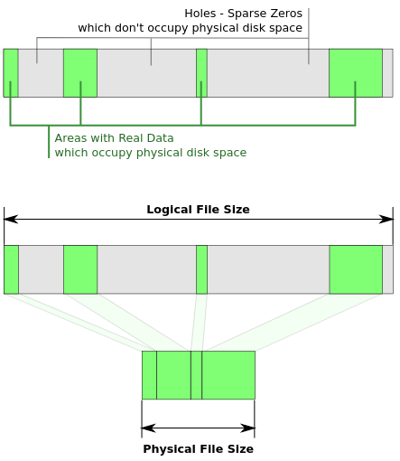

# Домашнее задание к занятию "3.5. Файловые системы"

##### 1. Узнайте о [sparse](https://ru.wikipedia.org/wiki/%D0%A0%D0%B0%D0%B7%D1%80%D0%B5%D0%B6%D1%91%D0%BD%D0%BD%D1%8B%D0%B9_%D1%84%D0%B0%D0%B9%D0%BB) (разряженных) файлах.

###### Ответ:

Суть в том чтобы использовать пространство на диске более эффективно, что позваляет:

- Увеличить время жизни устройства
- Сократить затраты на запись нулевых байт

Достигается посредством записи информации о нулевых байтах в метаданные ФС, а не фактической
записью 0 на диск.



##### 2. Могут ли файлы, являющиеся жесткой ссылкой на один объект, иметь разные права доступа и владельца? Почему?

###### Ответ:
Не могут, так как по сути это один и тот же файл ссылающийся на одиноковый inode в рамках одной ФС:
```bash
vagrant@vagrant:/tmp$ echo "vagrant" >> somefile.txt
vagrant@vagrant:/tmp$ cat somefile.txt
vagrant
vagrant@vagrant:/tmp$ stat somefile.txt
  File: somefile.txt
  Size: 8               Blocks: 8          IO Block: 4096   regular file
Device: fd00h/64768d    Inode: 1572893     Links: 1
Access: (0664/-rw-rw-r--)  Uid: ( 1000/ vagrant)   Gid: ( 1000/ vagrant)
Access: 2022-01-31 11:44:00.697558889 +0000
Modify: 2022-01-31 11:43:58.532476974 +0000
Change: 2022-01-31 11:43:58.532476974 +0000
 Birth: -
vagrant@vagrant:/tmp$ sudo -i
root@vagrant:/tmp# ln somefile.txt hardlink
root@vagrant:/tmp# ls -lah
total 84K
drwxrwxrwt 18 root    root    4.0K Jan 31 11:59 .
drwxr-xr-x 21 root    root    4.0K Jan 19 20:44 ..
drwxrwxrwt  2 root    root    4.0K Jan 26 15:37 .font-unix
-rw-rw-r--  2 vagrant vagrant    8 Jan 31 11:43 hardlink
drwxrwxrwt  2 root    root    4.0K Jan 26 15:37 .ICE-unix
drwx------  3 root    root    4.0K Jan 26 15:38 snap.lxd
-rw-rw-r--  2 vagrant vagrant    8 Jan 31 11:43 somefile.txt
root@vagrant:/tmp# cat hardlink
vagrant
root@vagrant:/tmp# cat somefile.txt
vagrant
root@vagrant:/tmp# stat hardlink
  File: hardlink
  Size: 8               Blocks: 8          IO Block: 4096   regular file
Device: fd00h/64768d    Inode: 1572893     Links: 2
Access: (0664/-rw-rw-r--)  Uid: ( 1000/ vagrant)   Gid: ( 1000/ vagrant)
Access: 2022-01-31 12:04:35.494569637 +0000
Modify: 2022-01-31 11:43:58.532476974 +0000
Change: 2022-01-31 11:59:58.944461068 +0000
 Birth: -
root@vagrant:/tmp# chmod 777 hardlink
root@vagrant:/tmp# ls -lah
total 84K
drwxrwxrwt 18 root    root    4.0K Jan 31 11:59 .
drwxr-xr-x 21 root    root    4.0K Jan 19 20:44 ..
drwxrwxrwt  2 root    root    4.0K Jan 26 15:37 .font-unix
-rwxrwxrwx  2 root    root       8 Jan 31 11:43 hardlink
drwxrwxrwt  2 root    root    4.0K Jan 26 15:37 .ICE-unix
drwx------  3 root    root    4.0K Jan 26 15:38 snap.lxd
-rwxrwxrwx  2 root    root       8 Jan 31 11:43 somefile.txt
```
##### 3. Сделайте `vagrant destroy` на имеющийся инстанс Ubuntu. Замените содержимое Vagrantfile следующим:

    ```bash
    Vagrant.configure("2") do |config|
      config.vm.box = "bento/ubuntu-20.04"
      config.vm.provider :virtualbox do |vb|
        lvm_experiments_disk0_path = "/tmp/lvm_experiments_disk0.vmdk"
        lvm_experiments_disk1_path = "/tmp/lvm_experiments_disk1.vmdk"
        vb.customize ['createmedium', '--filename', lvm_experiments_disk0_path, '--size', 2560]
        vb.customize ['createmedium', '--filename', lvm_experiments_disk1_path, '--size', 2560]
        vb.customize ['storageattach', :id, '--storagectl', 'SATA Controller', '--port', 1, '--device', 0, '--type', 'hdd', '--medium', lvm_experiments_disk0_path]
        vb.customize ['storageattach', :id, '--storagectl', 'SATA Controller', '--port', 2, '--device', 0, '--type', 'hdd', '--medium', lvm_experiments_disk1_path]
      end
    end
    ```

    Данная конфигурация создаст новую виртуальную машину с двумя дополнительными неразмеченными дисками по 2.5 Гб.
###### Ответ:
```bash
Disk /dev/sdb: 2.51 GiB, 2684354560 bytes, 5242880 sectors
Disk model: VBOX HARDDISK
Units: sectors of 1 * 512 = 512 bytes
Sector size (logical/physical): 512 bytes / 512 bytes
I/O size (minimum/optimal): 512 bytes / 512 bytes


Disk /dev/sdc: 2.51 GiB, 2684354560 bytes, 5242880 sectors
Disk model: VBOX HARDDISK
Units: sectors of 1 * 512 = 512 bytes
Sector size (logical/physical): 512 bytes / 512 bytes
I/O size (minimum/optimal): 512 bytes / 512 bytes

```
##### 4. Используя `fdisk`, разбейте первый диск на 2 раздела: 2 Гб, оставшееся пространство.
###### Ответ:
```bash
root@vagrant:~# fdisk -l /dev/sdb
Disk /dev/sdb: 2.51 GiB, 2684354560 bytes, 5242880 sectors
Disk model: VBOX HARDDISK
Units: sectors of 1 * 512 = 512 bytes
Sector size (logical/physical): 512 bytes / 512 bytes
I/O size (minimum/optimal): 512 bytes / 512 bytes
Disklabel type: dos
Disk identifier: 0xaa70c67b

Device     Boot   Start     End Sectors  Size Id Type
/dev/sdb1          2048 4196351 4194304    2G 83 Linux
/dev/sdb2       4196352 5242879 1046528  511M 83 Linux

```
##### 5. Используя `sfdisk`, перенесите данную таблицу разделов на второй диск.
###### Ответ:
```bash
sfdisk -d /dev/sdb | sfdisk /dev/sdc
>>> Script header accepted.
>>> Script header accepted.
>>> Script header accepted.
>>> Script header accepted.
>>> Created a new DOS disklabel with disk identifier 0xaa70c67b.
/dev/sdc1: Created a new partition 1 of type 'Linux' and of size 2 GiB.
/dev/sdc2: Created a new partition 2 of type 'Linux' and of size 511 MiB.
/dev/sdc3: Done.

New situation:
Disklabel type: dos
Disk identifier: 0xaa70c67b

Device     Boot   Start     End Sectors  Size Id Type
/dev/sdc1          2048 4196351 4194304    2G 83 Linux
/dev/sdc2       4196352 5242879 1046528  511M 83 Linux

The partition table has been altered.
Calling ioctl() to re-read partition table.
Syncing disks.
```
##### 6. Соберите `mdadm` RAID1 на паре разделов 2 Гб.
###### Ответ:
```bash
root@vagrant:~# mdadm -C -v /dev/md0 -l 1 -n 2 /dev/sdb1 /dev/sdc1
root@vagrant:~# cat /proc/mdstat
Personalities : [linear] [multipath] [raid0] [raid1] [raid6] [raid5] [raid4] [raid10]
md0 : active raid1 sdc1[1] sdb1[0]
      2094080 blocks super 1.2 [2/2] [UU]

unused devices: <none>
```
##### 7. Соберите `mdadm` RAID0 на второй паре маленьких разделов.
###### Ответ:
```bash
root@vagrant:~# mdadm -C -v /dev/md1 -l 0 -n 2 /dev/sdb2 /dev/sdc2
root@vagrant:~# cat /proc/mdstat
Personalities : [linear] [multipath] [raid0] [raid1] [raid6] [raid5] [raid4] [raid10]
md1 : active raid0 sdc2[1] sdb2[0]
      1042432 blocks super 1.2 512k chunks

md0 : active raid1 sdc1[1] sdb1[0]
      2094080 blocks super 1.2 [2/2] [UU]

unused devices: <none>
```
##### 8. Создайте 2 независимых PV на получившихся md-устройствах.
###### Ответ:
```bash
root@vagrant:~# pvcreate /dev/md0
  Physical volume "/dev/md0" successfully created.
root@vagrant:~# pvcreate /dev/md1
  Physical volume "/dev/md1" successfully created.
root@vagrant:~# pvdisplay
 "/dev/md0" is a new physical volume of "<2.00 GiB"
  --- NEW Physical volume ---
  PV Name               /dev/md0
  VG Name
  PV Size               <2.00 GiB
  Allocatable           NO
  PE Size               0
  Total PE              0
  Free PE               0
  Allocated PE          0
  PV UUID               SPEZo8-YW2D-lJjD-jl2Y-hNfD-DBZA-LG8lOC

  "/dev/md1" is a new physical volume of "1018.00 MiB"
  --- NEW Physical volume ---
  PV Name               /dev/md1
  VG Name
  PV Size               1018.00 MiB
  Allocatable           NO
  PE Size               0
  Total PE              0
  Free PE               0
  Allocated PE          0
  PV UUID               ntYFLv-W5qV-DYsP-NlbS-rA3O-k1ye-AB30hD
```
##### 9. Создайте общую volume-group на этих двух PV.
###### Ответ:
```bash
root@vagrant:~# vgcreate netology /dev/md0 /dev/md1
  Volume group "netology" successfully created
root@vagrant:~# vgs
  VG        #PV #LV #SN Attr   VSize   VFree
  netology    2   0   0 wz--n-  <2.99g  <2.99g
```

##### 10. Создайте LV размером 100 Мб, указав его расположение на PV с RAID0.

###### Ответ:
```bash
root@vagrant:~# lvcreate -L 100M -n netologylv /dev/netology /dev/md1
  Logical volume "netologylv" created.
root@vagrant:~# lvs -a -o +devices
  LV         VG        Attr       LSize   Pool Origin Data%  Meta%  Move Log Cpy%Sync Convert Devices
  netologylv netology  -wi-a----- 100.00m                                                     /dev/md1(0)
```
##### 11. Создайте `mkfs.ext4` ФС на получившемся LV.
###### Ответ:
```bash
root@vagrant:~# mkfs.ext4 /dev/netology/netologylv
mke2fs 1.45.5 (07-Jan-2020)
Creating filesystem with 25600 4k blocks and 25600 inodes

Allocating group tables: done
Writing inode tables: done
Creating journal (1024 blocks): done
Writing superblocks and filesystem accounting information: done
root@vagrant:~# lsblk -f /dev/netology/netologylv
NAME                FSTYPE LABEL UUID                                 FSAVAIL FSUSE% MOUNTPOINT
netology-netologylv ext4         f435ad07-758d-436a-9df1-6e73c6086b41

```
##### 12. Смонтируйте этот раздел в любую директорию, например, `/tmp/new`.
###### Ответ:
```bash
root@vagrant:~# cd /
root@vagrant:/# mkdir netmnt
root@vagrant:/# mount /dev/netology/netologylv /netmnt
root@vagrant:/# echo $?
0
root@vagrant:/netmnt# ls -lah /netmnt/
total 24K
drwxr-xr-x  3 root root 4.0K Jan 31 14:48 .
drwxr-xr-x 22 root root 4.0K Jan 31 14:52 ..
drwx------  2 root root  16K Jan 31 14:48 lost+found
```

##### 13. Поместите туда тестовый файл, например `wget https://mirror.yandex.ru/ubuntu/ls-lR.gz -O /tmp/new/test.gz`.
###### Ответ:
```bash
root@vagrant:/netmnt# pwd
/netmnt
root@vagrant:/netmnt# wget https://mirror.yandex.ru/ubuntu/ls-lR.gz -O test.gz
--2022-01-31 14:57:16--  https://mirror.yandex.ru/ubuntu/ls-lR.gz
Resolving mirror.yandex.ru (mirror.yandex.ru)... 213.180.204.183, 2a02:6b8::183
Connecting to mirror.yandex.ru (mirror.yandex.ru)|213.180.204.183|:443... connected.
HTTP request sent, awaiting response... 200 OK
Length: 21995563 (21M) [application/octet-stream]
Saving to: ‘/netmnt/test.gz’

/netmnt/test.gz                           100%[=====================================================================================>]  20.98M  1.13MB/s    in 17s

2022-01-31 14:57:34 (1.20 MB/s) - ‘test.gz’ saved [21995563/21995563]

```
##### 14. Прикрепите вывод `lsblk`.
###### Ответ:
```bash
root@vagrant:/netmnt# lsblk
NAME                      MAJ:MIN RM  SIZE RO TYPE  MOUNTPOINT
loop0                       7:0    0 55.5M  1 loop  /snap/core18/2284
loop1                       7:1    0 55.4M  1 loop  /snap/core18/2128
loop2                       7:2    0 61.9M  1 loop  /snap/core20/1328
loop3                       7:3    0 70.3M  1 loop  /snap/lxd/21029
loop4                       7:4    0 43.4M  1 loop  /snap/snapd/14549
loop5                       7:5    0 32.3M  1 loop  /snap/snapd/12704
loop6                       7:6    0 67.2M  1 loop  /snap/lxd/21835
sda                         8:0    0   64G  0 disk
├─sda1                      8:1    0    1M  0 part
├─sda2                      8:2    0    1G  0 part  /boot
└─sda3                      8:3    0   63G  0 part
  └─ubuntu--vg-ubuntu--lv 253:0    0 31.5G  0 lvm   /
sdb                         8:16   0  2.5G  0 disk
├─sdb1                      8:17   0    2G  0 part
│ └─md0                     9:0    0    2G  0 raid1
└─sdb2                      8:18   0  511M  0 part
  └─md1                     9:1    0 1018M  0 raid0
    └─netology-netologylv 253:1    0  100M  0 lvm   /netmnt
sdc                         8:32   0  2.5G  0 disk
├─sdc1                      8:33   0    2G  0 part
│ └─md0                     9:0    0    2G  0 raid1
└─sdc2                      8:34   0  511M  0 part
  └─md1                     9:1    0 1018M  0 raid0
    └─netology-netologylv 253:1    0  100M  0 lvm   /netmnt
```

##### 15. Протестируйте целостность файла:

     ```bash
     root@vagrant:~# gzip -t /tmp/new/test.gz
     root@vagrant:~# echo $?
     0
     ```
###### Ответ:
```bash
root@vagrant:/netmnt# ls -lah
total 22M
drwxr-xr-x  3 root root 4.0K Jan 31 14:57 .
drwxr-xr-x 22 root root 4.0K Jan 31 14:52 ..
drwx------  2 root root  16K Jan 31 14:48 lost+found
-rw-r--r--  1 root root  21M Jan 31 09:42 test.gz
root@vagrant:/netmnt# gzip -t test.gz
root@vagrant:/netmnt# echo $?
0
```

##### 16. Используя pvmove, переместите содержимое PV с RAID0 на RAID1.
###### Ответ:
```bash
root@vagrant:/# pvmove /dev/md1 /dev/md0
  /dev/md1: Moved: 12.00%
  /dev/md1: Moved: 100.00%
root@vagrant:/# lvs -a -o +devices
  LV         VG        Attr       LSize   Pool Origin Data%  Meta%  Move Log Cpy%Sync Convert Devices
  netologylv netology  -wi-ao---- 100.00m                                                     /dev/md0(0)
```
##### 17. Сделайте `--fail` на устройство в вашем RAID1 md.
###### Ответ:
```bash

```
##### 18. Подтвердите выводом `dmesg`, что RAID1 работает в деградированном состоянии.
###### Ответ:
```bash
root@vagrant:/# mdadm /dev/md0 -f /dev/sdc1
mdadm: set /dev/sdc1 faulty in /dev/md0
root@vagrant:/# dmesg -T | tail -2
[Tue Feb  1 16:00:59 2022] md/raid1:md0: Disk failure on sdc1, disabling device.
                           md/raid1:md0: Operation continuing on 1 devices.
root@vagrant:/# cat /proc/mdstat
Personalities : [raid1] [raid0] [linear] [multipath] [raid6] [raid5] [raid4] [raid10]
md0 : active raid1 sdb1[0] sdc1[1](F)
      2094080 blocks super 1.2 [2/1] [U_]

md1 : active raid0 sdb2[0] sdc2[1]
      1042432 blocks super 1.2 512k chunks

unused devices: <none>

```
##### 19. Протестируйте целостность файла, несмотря на "сбойный" диск он должен продолжать быть доступен:

     ```bash
     root@vagrant:~# gzip -t /tmp/new/test.gz
     root@vagrant:~# echo $?
     0
     ```
###### Ответ:
```bash
root@vagrant:/# cd /netmnt/
root@vagrant:/netmnt# ls
lost+found  test.gz
root@vagrant:/netmnt# cd ..
root@vagrant:/# gzip -t /netmnt/test.gz
root@vagrant:/# echo $?
0
```