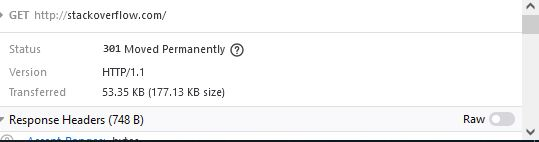
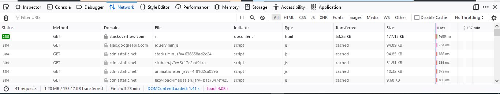

# Домашнее задание к занятию "3.6. Компьютерные сети, лекция 1"

##### 1. Работа c HTTP через телнет.
- Подключитесь утилитой телнет к сайту stackoverflow.com
`telnet stackoverflow.com 80`
- отправьте HTTP запрос
```bash
GET /questions HTTP/1.0
HOST: stackoverflow.com
[press enter]
[press enter]
```
- В ответе укажите полученный HTTP код, что он означает?
###### Ответ:
```bash
HTTP/1.1 301 Moved Permanently
cache-control: no-cache, no-store, must-revalidate
location: https://stackoverflow.com/questions
```
Говорит о том что ресурс был перемещен по новому адресу, который указан в поле 
`location` т.е. к данному ресуру `/questions` нужно обращаться по протоколу 
`https`  
##### 2. Повторите задание 1 в браузере, используя консоль разработчика F12.
###### Ответ:
- откройте вкладку `Network`
- отправьте запрос http://stackoverflow.com
- найдите первый ответ HTTP сервера, откройте вкладку `Headers`
- укажите в ответе полученный HTTP код.


- проверьте время загрузки страницы, какой запрос обрабатывался дольше всего?

Дольше всего обрабатывался запрос к `/` `stackoverflow.com` (1680ms)

- приложите скриншот консоли браузера в ответ.


##### 3. Какой IP адрес у вас в интернете?
###### Ответ:
Деаноните =) ?

`88.201.199.22`
##### 4. Какому провайдеру принадлежит ваш IP адрес? Какой автономной системе AS? Воспользуйтесь утилитой `whois`
###### Ответ:

Провайдер: `iWAN` - он же `SkyNet`.

Автономная система: `AS35511`.


##### 5. Через какие сети проходит пакет, отправленный с вашего компьютера на адрес 8.8.8.8? Через какие AS? Воспользуйтесь утилитой `traceroute`
###### Ответ:
```bash
root@vagrant:~# traceroute -AI 8.8.8.8
traceroute to 8.8.8.8 (8.8.8.8), 30 hops max, 60 byte packets
 1  _gateway (10.0.2.2) [*]  0.261 ms  0.218 ms  0.189 ms
 2  spb-new0ne-gw (192.168.78.30) [*]  1252.467 ms  1252.811 ms  1252.801 ms
 3  93.100.112.1.pool.sknt.ru (93.100.112.1) [AS35807]  1252.793 ms  1252.779 ms  1252.988 ms
 4  sel-core (93.100.0.134) [AS35807]  1252.979 ms  1253.195 ms  1253.184 ms
 5  * * *
 6  * 74.125.244.129 (74.125.244.129) [AS15169]  186.533 ms  186.509 ms
 7  74.125.244.133 (74.125.244.133) [AS15169]  186.206 ms  466.554 ms  466.938 ms
 8  142.251.61.221 (142.251.61.221) [AS15169]  466.927 ms  466.918 ms  467.061 ms
 9  216.239.63.65 (216.239.63.65) [AS15169]  467.051 ms * *
10  * * *
11  * * *
12  * * *
13  * * *
14  * * *
15  * * *
16  * * *
17  * * *
18  * * *
19  dns.google (8.8.8.8) [AS15169]  938.921 ms  938.720 ms *
```

##### 6. Повторите задание 5 в утилите `mtr`. На каком участке наибольшая задержка - delay?
###### Ответ:
Вывод весьма спорный, в плане того что недостаточно исторических метрик что-бы точно 
оценить где наибольший delay, но исходя из того что есть и опираясь на поле `Avg` RTT -
 `6. AS15169  74.125.244.129`
```bash
Keys:  Help   Display mode   Restart statistics   Order of fields   quit
                                                                                                                                      Packets               Pings
 Host                                                                                                                               Loss%   Last  Best   Avg  Wrst Jmax
 1. AS???    _gateway                                                                                                                0.0%    0.2   0.1   0.9  16.6 16.4
 2. AS???    mygw                                                                                                                    0.0%   83.9  78.2  99.8 197.8 114.
 3. AS35807  93.100.112.1.pool.sknt.ru                                                                                               0.0%  130.5  81.2 134.5 197.5 66.7
 4. AS35807  sel-core                                                                                                                1.8%  180.5  79.9 159.3 210.4 123.
 5. AS15169  72.14.216.110                                                                                                           1.8%  132.5  80.9 147.7 216.2 126.
 6. AS15169  74.125.244.129                                                                                                          1.8%   87.4  84.8 161.4 215.0 81.3
 7. AS15169  74.125.244.133                                                                                                          1.8%   98.6  82.2 159.2 229.6 122.
 8. AS15169  142.251.61.221                                                                                                          1.8%   81.3  81.3 150.3 214.1 119.
 9. AS15169  216.239.63.65                                                                                                           1.8%  211.4  93.4 161.0 231.2 107.
10. (waiting for reply)
11. (waiting for reply)
12. (waiting for reply)
13. (waiting for reply)
14. (waiting for reply)
15. (waiting for reply)
16. (waiting for reply)
17. (waiting for reply)
18. (waiting for reply)
19. AS15169  dns.google                                                                                                             14.3%  102.2  82.7  99.0 205.7 118.

```
##### 7. Какие DNS сервера отвечают за доменное имя dns.google? Какие A записи? воспользуйтесь утилитой `dig`
###### Ответ:
За доменное имя `dns.google` отвечают следующие NS сервера:
```bash
root@vagrant:~# dig -t NS  dns.google

; <<>> DiG 9.16.1-Ubuntu <<>> -t NS dns.google
;; global options: +cmd
;; Got answer:
;; ->>HEADER<<- opcode: QUERY, status: NOERROR, id: 38581
;; flags: qr rd ra; QUERY: 1, ANSWER: 4, AUTHORITY: 0, ADDITIONAL: 1

;; OPT PSEUDOSECTION:
; EDNS: version: 0, flags:; udp: 65494
;; QUESTION SECTION:
;dns.google.                    IN      NS

;; ANSWER SECTION:
dns.google.             19466   IN      NS      ns4.zdns.google.
dns.google.             19466   IN      NS      ns2.zdns.google.
dns.google.             19466   IN      NS      ns1.zdns.google.
dns.google.             19466   IN      NS      ns3.zdns.google.

;; Query time: 103 msec
;; SERVER: 127.0.0.53#53(127.0.0.53)
;; WHEN: Wed Feb 09 20:52:14 UTC 2022
;; MSG SIZE  rcvd: 116
```
A-записи:
```bash
root@vagrant:~# dig @ns1.zdns.google -t A dns.google

; <<>> DiG 9.16.1-Ubuntu <<>> @ns1.zdns.google -t A dns.google
; (2 servers found)
;; global options: +cmd
;; Got answer:
;; ->>HEADER<<- opcode: QUERY, status: NOERROR, id: 3994
;; flags: qr aa rd; QUERY: 1, ANSWER: 2, AUTHORITY: 0, ADDITIONAL: 1
;; WARNING: recursion requested but not available

;; OPT PSEUDOSECTION:
; EDNS: version: 0, flags:; udp: 512
;; QUESTION SECTION:
;dns.google.                    IN      A

;; ANSWER SECTION:
dns.google.             900     IN      A       8.8.4.4
dns.google.             900     IN      A       8.8.8.8

;; Query time: 116 msec
;; SERVER: 216.239.32.114#53(216.239.32.114)
;; WHEN: Wed Feb 09 20:56:46 UTC 2022
;; MSG SIZE  rcvd: 71
```
##### 8. Проверьте PTR записи для IP адресов из задания 7. Какое доменное имя привязано к IP? воспользуйтесь утилитой `dig`
###### Ответ:
IP адреса `8.8.8.8` и `8.8.4.4` имеют следующие PTR-записи:
```bash
root@vagrant:~# dig -x 8.8.8.8

; <<>> DiG 9.16.1-Ubuntu <<>> -x 8.8.8.8
;; global options: +cmd
;; Got answer:
;; ->>HEADER<<- opcode: QUERY, status: NOERROR, id: 53321
;; flags: qr rd ra; QUERY: 1, ANSWER: 1, AUTHORITY: 0, ADDITIONAL: 1

;; OPT PSEUDOSECTION:
; EDNS: version: 0, flags:; udp: 65494
;; QUESTION SECTION:
;8.8.8.8.in-addr.arpa.          IN      PTR

;; ANSWER SECTION:
8.8.8.8.in-addr.arpa.   4679    IN      PTR     dns.google.

;; Query time: 0 msec
;; SERVER: 127.0.0.53#53(127.0.0.53)
;; WHEN: Wed Feb 09 21:00:38 UTC 2022
;; MSG SIZE  rcvd: 73

root@vagrant:~# dig -x 8.8.4.4

; <<>> DiG 9.16.1-Ubuntu <<>> -x 8.8.4.4
;; global options: +cmd
;; Got answer:
;; ->>HEADER<<- opcode: QUERY, status: NOERROR, id: 55202
;; flags: qr rd ra; QUERY: 1, ANSWER: 1, AUTHORITY: 0, ADDITIONAL: 1

;; OPT PSEUDOSECTION:
; EDNS: version: 0, flags:; udp: 65494
;; QUESTION SECTION:
;4.4.8.8.in-addr.arpa.          IN      PTR

;; ANSWER SECTION:
4.4.8.8.in-addr.arpa.   18622   IN      PTR     dns.google.

;; Query time: 91 msec
;; SERVER: 127.0.0.53#53(127.0.0.53)
;; WHEN: Wed Feb 09 21:00:45 UTC 2022
;; MSG SIZE  rcvd: 73
```