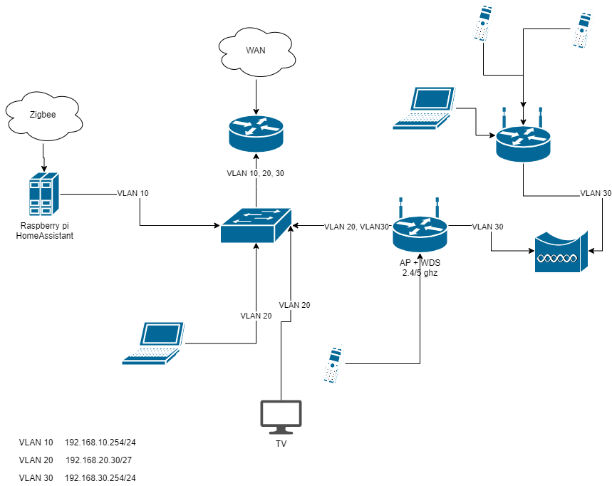

# Домашнее задание к занятию "3.8. Компьютерные сети, лекция 3"

##### 1. Подключитесь к публичному маршрутизатору в интернет. Найдите маршрут к вашему публичному IP
```
telnet route-views.routeviews.org
Username: rviews
show ip route x.x.x.x/32
show bgp x.x.x.x/32
```
###### Ответ:
```
route-views> show ip route 88.201.199.22
Routing entry for 88.201.128.0/17
  Known via "bgp 6447", distance 20, metric 0
  Tag 6939, type external
  Last update from 64.71.137.241 3w4d ago
  Routing Descriptor Blocks:
  * 64.71.137.241, from 64.71.137.241, 3w4d ago
      Route metric is 0, traffic share count is 1
      AS Hops 2
      Route tag 6939
      MPLS label: none
```
```
route-views>show bgp 88.201.199.22
BGP routing table entry for 88.201.128.0/17, version 251042
Paths: (23 available, best #22, table default)
  Not advertised to any peer
  Refresh Epoch 1
  701 3356 9002 35807
    137.39.3.55 from 137.39.3.55 (137.39.3.55)
      Origin IGP, localpref 100, valid, external, atomic-aggregate
      path 7FE14CFA2D80 RPKI State not found
      rx pathid: 0, tx pathid: 0
  Refresh Epoch 1
  3549 3356 9002 35807
    208.51.134.254 from 208.51.134.254 (67.16.168.191)
      Origin IGP, metric 0, localpref 100, valid, external, atomic-aggregate
      Community: 3356:2 3356:22 3356:100 3356:123 3356:503 3356:903 3356:2067 3549:2581 3549:30840
      path 7FE13B7436A8 RPKI State not found
      rx pathid: 0, tx pathid: 0
  Refresh Epoch 1
  53767 174 20764 35807
    162.251.163.2 from 162.251.163.2 (162.251.162.3)
      Origin IGP, localpref 100, valid, external, atomic-aggregate
      Community: 174:21101 174:22014 53767:5000
      path 7FE07FA8C2C0 RPKI State not found
      rx pathid: 0, tx pathid: 0
  Refresh Epoch 1
  3356 9002 35807
    4.68.4.46 from 4.68.4.46 (4.69.184.201)
      Origin IGP, metric 0, localpref 100, valid, external, atomic-aggregate
      Community: 3356:2 3356:22 3356:100 3356:123 3356:503 3356:903 3356:2067
      path 7FE0F72D3ED0 RPKI State not found
      rx pathid: 0, tx pathid: 0
  Refresh Epoch 1
  8283 20764 35807
    94.142.247.3 from 94.142.247.3 (94.142.247.3)
      Origin IGP, metric 0, localpref 100, valid, external, atomic-aggregate
      Community: 8283:1 8283:101 20764:3002 20764:3010 20764:3021 35807:1551 35807:5000
      unknown transitive attribute: flag 0xE0 type 0x20 length 0x18
        value 0000 205B 0000 0000 0000 0001 0000 205B
              0000 0005 0000 0001
      path 7FE175F1E948 RPKI State not found
      rx pathid: 0, tx pathid: 0
  Refresh Epoch 1
  4901 6079 9002 35807
    162.250.137.254 from 162.250.137.254 (162.250.137.254)
      Origin IGP, localpref 100, valid, external, atomic-aggregate
      Community: 65000:10100 65000:10300 65000:10400
      path 7FE09E48D688 RPKI State not found
      rx pathid: 0, tx pathid: 0
  Refresh Epoch 1
  57866 9002 35807
    37.139.139.17 from 37.139.139.17 (37.139.139.17)
      Origin IGP, metric 0, localpref 100, valid, external, atomic-aggregate
      Community: 9002:0 9002:64667
      path 7FE166C42D08 RPKI State not found
      rx pathid: 0, tx pathid: 0
  Refresh Epoch 1
  852 3356 9002 35807
    154.11.12.212 from 154.11.12.212 (96.1.209.43)
      Origin IGP, metric 0, localpref 100, valid, external, atomic-aggregate
      path 7FE026678A18 RPKI State not found
      rx pathid: 0, tx pathid: 0
  Refresh Epoch 1
  20912 3257 9002 35807
    212.66.96.126 from 212.66.96.126 (212.66.96.126)
      Origin IGP, localpref 100, valid, external, atomic-aggregate
      Community: 3257:8052 3257:50001 3257:54900 3257:54901 20912:65004 65535:65284
      path 7FE14AD3D4F0 RPKI State not found
      rx pathid: 0, tx pathid: 0
  Refresh Epoch 1
  3303 6939 35807
    217.192.89.50 from 217.192.89.50 (138.187.128.158)
      Origin IGP, localpref 100, valid, external, atomic-aggregate
      Community: 3303:1006 3303:1021 3303:1030 3303:3067 6939:7040 6939:8752 6939:9002
      path 7FE12ABCFFB0 RPKI State not found
      rx pathid: 0, tx pathid: 0
  Refresh Epoch 1
  3333 20764 35807
    193.0.0.56 from 193.0.0.56 (193.0.0.56)
      Origin IGP, localpref 100, valid, external, atomic-aggregate
      Community: 20764:3002 20764:3010 20764:3021 35807:1551 35807:5000
      path 7FE0B9DCBED8 RPKI State not found
      rx pathid: 0, tx pathid: 0
  Refresh Epoch 1
  7018 3356 9002 35807
    12.0.1.63 from 12.0.1.63 (12.0.1.63)
      Origin IGP, localpref 100, valid, external, atomic-aggregate
      Community: 7018:5000 7018:37232
      path 7FE134473FC8 RPKI State not found
      rx pathid: 0, tx pathid: 0
  Refresh Epoch 1
  3561 3910 3356 9002 35807
    206.24.210.80 from 206.24.210.80 (206.24.210.80)
      Origin IGP, localpref 100, valid, external, atomic-aggregate
      path 7FE0EEEFD2F0 RPKI State not found
      rx pathid: 0, tx pathid: 0
  Refresh Epoch 1
  1351 6939 35807
    132.198.255.253 from 132.198.255.253 (132.198.255.253)
      Origin IGP, localpref 100, valid, external, atomic-aggregate
      path 7FE110D08990 RPKI State not found
      rx pathid: 0, tx pathid: 0
  Refresh Epoch 1
  20130 6939 35807
    140.192.8.16 from 140.192.8.16 (140.192.8.16)
      Origin IGP, localpref 100, valid, external, atomic-aggregate
      path 7FE0E50F11B0 RPKI State not found
      rx pathid: 0, tx pathid: 0
  Refresh Epoch 1
  7660 2516 1299 9002 35807
    203.181.248.168 from 203.181.248.168 (203.181.248.168)
      Origin IGP, localpref 100, valid, external, atomic-aggregate
      Community: 2516:1030 7660:9003
      path 7FE053725D30 RPKI State not found
      rx pathid: 0, tx pathid: 0
  Refresh Epoch 1
  101 174 20764 35807
    209.124.176.223 from 209.124.176.223 (209.124.176.223)
      Origin IGP, localpref 100, valid, external, atomic-aggregate
      Community: 101:20100 101:20110 101:22100 174:21101 174:22014
      Extended Community: RT:101:22100
      path 7FE1359B49B8 RPKI State not found
      rx pathid: 0, tx pathid: 0
  Refresh Epoch 2
  2497 174 20764 35807
    202.232.0.2 from 202.232.0.2 (58.138.96.254)
      Origin IGP, localpref 100, valid, external, atomic-aggregate
      path 7FE10D4CBB88 RPKI State not found
      rx pathid: 0, tx pathid: 0
  Refresh Epoch 1
  49788 1299 9002 35807
    91.218.184.60 from 91.218.184.60 (91.218.184.60)
      Origin IGP, localpref 100, valid, external, atomic-aggregate
      Community: 1299:20000
      Extended Community: 0x43:100:1
      path 7FE1299FC0A0 RPKI State not found
      rx pathid: 0, tx pathid: 0
  Refresh Epoch 1
  1221 4637 9002 35807
    203.62.252.83 from 203.62.252.83 (203.62.252.83)
      Origin IGP, localpref 100, valid, external, atomic-aggregate
      path 7FE18EAA0908 RPKI State not found
      rx pathid: 0, tx pathid: 0
  Refresh Epoch 1
  3257 9002 35807
    89.149.178.10 from 89.149.178.10 (213.200.83.26)
      Origin IGP, metric 10, localpref 100, valid, external, atomic-aggregate
      Community: 3257:8052 3257:50001 3257:54900 3257:54901 65535:65284
      path 7FE11BB8DC98 RPKI State not found
      rx pathid: 0, tx pathid: 0
  Refresh Epoch 1
  6939 35807
    64.71.137.241 from 64.71.137.241 (216.218.252.164)
      Origin IGP, localpref 100, valid, external, atomic-aggregate, best
      path 7FE02B015898 RPKI State not found
      rx pathid: 0, tx pathid: 0x0
  Refresh Epoch 1
  19214 3257 9002 35807
    208.74.64.40 from 208.74.64.40 (208.74.64.40)
      Origin IGP, localpref 100, valid, external, atomic-aggregate
      Community: 3257:8791 3257:50001 3257:53100 3257:53101 65535:65284
      path 7FE0497BD4A8 RPKI State not found
      rx pathid: 0, tx pathid: 0
```
##### 2. Создайте dummy0 интерфейс в Ubuntu. Добавьте несколько статических маршрутов. Проверьте таблицу маршрутизации.
###### Ответ:
Для того что-бы создать dummy интерфейс нужно загрузить модуль `dummy` 
передав ему параметр `numdummies=1` (кол-во интерфейсов)
```bash
root@vagrant:/home/vagrant# modprobe -v dummy numdummies=1
insmod /lib/modules/5.4.0-91-generic/kernel/drivers/net/dummy.ko numdummies=0 numdummies=1
#Проверяем что модуль загружен:
root@vagrant:/home/vagrant# lsmod | grep dum
dummy                  16384  0
#Проверяем что интерфейс создался:
root@vagrant:/home/vagrant# ip link sh | grep "dum"
4: dummy0: <BROADCAST,NOARP> mtu 1500 qdisc noop state DOWN mode DEFAULT group default qlen 1000
#Добавим адрес и включим интерфейс:
root@vagrant:/# ip address add 192.168.168.168/32 dev dummy0
root@vagrant:/# ip link set dummy0 up
root@vagrant:/# ip -br -c addr show dev dummy0
dummy0           UNKNOWN        192.168.168.168/32 fe80::1c34:b0ff:fe5d:870e/64

```
Добавление статических маршрутов:
```bash
root@vagrant:/# ip route add 8.8.8.8/32 via 10.0.2.2
root@vagrant:/# ip rout add 8.8.4.4 via 10.0.2.2 dev eth0 src 10.0.2.15 metric 95
#Проверяем:
root@vagrant:/# ip ro
default via 10.0.2.2 dev eth0 proto dhcp src 10.0.2.15 metric 100
8.8.4.4 via 10.0.2.2 dev eth0 src 10.0.2.15 metric 95
8.8.8.8 via 10.0.2.2 dev eth0
10.0.2.0/24 dev eth0 proto kernel scope link src 10.0.2.15
10.0.2.2 dev eth0 proto dhcp scope link src 10.0.2.15 metric 100
```
Для персистентности:
```bash
cat << 'EOF' > /etc/network/interfaces.d/dummy0
auto dummy0
iface dummy0 inet static
 address 192.168.168.168/32
 pre-up ip link add dummy0 type dummy
 post-down ip link del dummy0
 post-up ip route add 8.8.8.8/32 via 10.0.2.2
 post-up ip route add 8.8.4.4 via 10.0.2.2 dev eth0 src 10.0.2.15 metric 95
EOF
```
##### 3. Проверьте открытые TCP порты в Ubuntu, какие протоколы и приложения используют эти порты? Приведите несколько примеров.
###### Ответ:
`ss -ta` - выведем все открытые TCP-соединения и протоколы которые используют конкретный порт
описанные в файле `/etc/services`:
```bash
root@vagrant:~# ss -ta
State              Recv-Q             Send-Q                          Local Address:Port                             Peer Address:Port              Process
LISTEN             0                  4096                            127.0.0.53%lo:domain                                0.0.0.0:*
LISTEN             0                  128                                   0.0.0.0:ssh                                   0.0.0.0:*
ESTAB              0                  0                                   10.0.2.15:ssh                                  10.0.2.2:22169
LISTEN             0                  128                                      [::]:ssh                                      [::]:*
```
`ss -tanp` - тоже что и `ss -ta` + без резолвинга протоколов и выводом приложений которые используют 
данный сокет:
```bash
root@vagrant:~# ss -tanp
State         Recv-Q        Send-Q               Local Address:Port               Peer Address:Port        Process
LISTEN        0             4096                 127.0.0.53%lo:53                      0.0.0.0:*            users:(("systemd-resolve",pid=675,fd=13))
LISTEN        0             128                        0.0.0.0:22                      0.0.0.0:*            users:(("sshd",pid=880,fd=3))
ESTAB         0             0                        10.0.2.15:22                     10.0.2.2:22169        users:(("sshd",pid=1208,fd=4),("sshd",pid=1160,fd=4))
LISTEN        0             128                           [::]:22                         [::]:*            users:(("sshd",pid=880,fd=4))

```
Используемые протоколы и приложения:
- ssh(tcp\22) - sshd
- dns(tcp\53) - systemd-resolve

В том числе IPv6 для ssh.
##### 4. Проверьте используемые UDP сокеты в Ubuntu, какие протоколы и приложения используют эти порты?
###### Ответ:
`ss -uanp` - через ключ`u` просим вывести UDP-сокеты.
UDP\53 - dns 
UDP\68 - dhcp 
```bash
root@vagrant:~# ss -uanp
State          Recv-Q         Send-Q                  Local Address:Port                   Peer Address:Port         Process
UNCONN         0              0                       127.0.0.53%lo:53                          0.0.0.0:*             users:(("systemd-resolve",pid=675,fd=12))
UNCONN         0              0                      10.0.2.15%eth0:68                          0.0.0.0:*             users:(("systemd-network",pid=640,fd=19))

```
Используемые протоколы и приложения:
- dns(udp\53) - systemd-resolve
- dhcp(udp\68) - systemd-network

##### 5. Используя diagrams.net, создайте L3 диаграмму вашей домашней сети или любой другой сети, с которой вы работали. 


## Задание для самостоятельной отработки (необязательно к выполнению)

6*. Установите Nginx, настройте в режиме балансировщика TCP или UDP.

7*. Установите bird2, настройте динамический протокол маршрутизации RIP.

8*. Установите Netbox, создайте несколько IP префиксов, используя curl проверьте работу API.