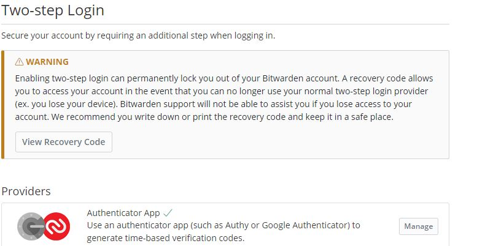
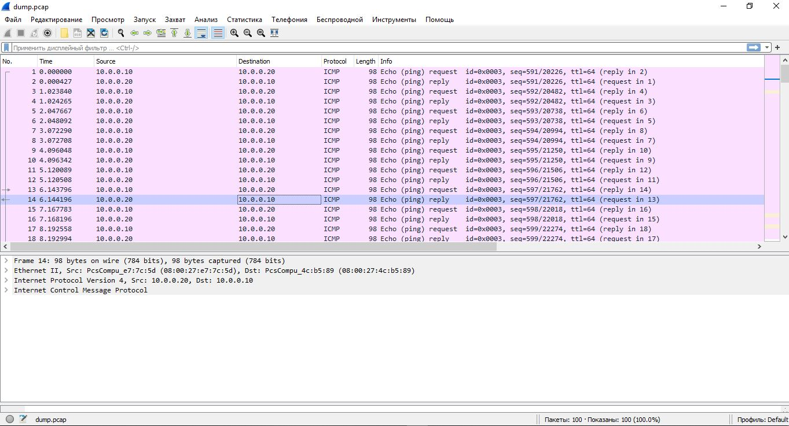

# Домашнее задание к занятию "3.9. Элементы безопасности информационных систем"

##### 1. Установите Bitwarden плагин для браузера. Зарегестрируйтесь и сохраните несколько паролей.
###### Ответ:

##### 2. Установите Google authenticator на мобильный телефон. Настройте вход в Bitwarden акаунт через Google authenticator OTP.
###### Ответ:


##### 3. Установите apache2, сгенерируйте самоподписанный сертификат, настройте тестовый сайт для работы по HTTPS.
###### Ответ:

```bash
#Устанавливаем apache2
vagrant@vagrant:~$ sudo apt install apache2

#Добавим дерективу ServerName
echo 'ServerName localhost' | sudo tee -a /etc/apache2/apache2.conf > /dev/null
#Генерируем самоподписный сертификат
vagrant@vagrant:~$ sudo openssl req -x509 -nodes -days 365 -newkey rsa:2048 -keyout /etc/ssl/private/127.0.0.1-selfsigned.key -out /etc/ssl/certs/127.0.0.1-selfsigned.crt
Generating a RSA private key
.......+++++
...+++++
writing new private key to '/etc/ssl/private/127.0.0.1-selfsigned.key'
-----
You are about to be asked to enter information that will be incorporated
into your certificate request.
What you are about to enter is what is called a Distinguished Name or a DN.
There are quite a few fields but you can leave some blank
For some fields there will be a default value,
If you enter '.', the field will be left blank.
-----
Country Name (2 letter code) [AU]:RU
State or Province Name (full name) [Some-State]:SPB
Locality Name (eg, city) []:SPB city
Organization Name (eg, company) [Internet Widgits Pty Ltd]:netology
Organizational Unit Name (eg, section) []:IT Dep
Common Name (e.g. server FQDN or YOUR name) []:127.0.0.1
Email Address []:someone@likeyou.com
#Активируем модуль mod_ssl для поддержки шифрования TLS
vagrant@vagrant:~$ sudo a2enmod ssl
Considering dependency setenvif for ssl:
Module setenvif already enabled
Considering dependency mime for ssl:
Module mime already enabled
Considering dependency socache_shmcb for ssl:
Enabling module socache_shmcb.
Enabling module ssl.
See /usr/share/doc/apache2/README.Debian.gz on how to configure SSL and create self-signed certificates.
To activate the new configuration, you need to run:
  systemctl restart apache2
#Создаем файл конфигурации apache2 
sudo bash -c "cat << 'EOF' > /etc/apache2/sites-available/127.0.0.1.conf
<VirtualHost *:443>
   ServerName 127.0.0.1
   DocumentRoot /var/www/127.0.0.1

   SSLEngine on
   SSLCertificateFile /etc/ssl/certs/127.0.0.1-selfsigned.crt
   SSLCertificateKeyFile /etc/ssl/private/127.0.0.1-selfsigned.key
</VirtualHost>
<VirtualHost *:80>
	ServerName 127.0.0.1
	Redirect / https://127.0.0.1/
</VirtualHost>
EOF"
#Создадим каталог сайта
sudo mkdir /var/www/127.0.0.1 && sudo bash -c 'cat << 'EOF' > /var/www/127.0.0.1/index.html
<h1>Hello world!</h1>
EOF'
#Активируем сайт
sudo a2ensite 127.0.0.1.conf
#Проверяем конфигурацию
vagrant@vagrant:~$ sudo apache2ctl configtest
Syntax OK
#Перечитываем конфигурацию
sudo systemctl reload apache2
```
Добавляем в vagranfile следующие строки для мапинга портов:
```
config.vm.network "forwarded_port", guest: 80, host: 8081, host_ip: "127.0.0.1"
config.vm.network "forwarded_port", guest: 443, host: 8082, host_ip: "127.0.0.1"
#Перечитываем конфигурацию vagrant
vagrant reload
```
Проверяем:

##### 4. Проверьте на TLS уязвимости произвольный сайт в интернете (кроме сайтов МВД, ФСБ, МинОбр, НацБанк, РосКосмос, РосАтом, РосНАНО и любых госкомпаний, объектов КИИ, ВПК ... и тому подобное).
###### Ответ:
Получим все A-записи домаена `vk.com` с помощью утилиты `host`:
```bash
vagrant@vagrant:~/testssl.sh$ host -v -t A vk.com
Trying "vk.com"
;; ->>HEADER<<- opcode: QUERY, status: NOERROR, id: 35629
;; flags: qr rd ra; QUERY: 1, ANSWER: 6, AUTHORITY: 0, ADDITIONAL: 0

;; QUESTION SECTION:
;vk.com.                                IN      A

;; ANSWER SECTION:
vk.com.                 39      IN      A       87.240.190.67
vk.com.                 39      IN      A       87.240.137.158
vk.com.                 39      IN      A       87.240.139.194
vk.com.                 39      IN      A       93.186.225.208
vk.com.                 39      IN      A       87.240.190.78
vk.com.                 39      IN      A       87.240.190.72

Received 120 bytes from 127.0.0.53#53 in 103 ms
```
Проверим на используемые версии TLS и уязвимости один из хостов `vk.com` с помощью утилиты(скрипта) `testssl.sh`

```bash
vagrant@vagrant:~/testssl.sh$ ./testssl.sh -U -p --sneaky https://87.240.190.67

###########################################################
    testssl.sh       3.1dev from https://testssl.sh/dev/
    (7b38198 2022-02-17 09:04:23 -- )

      This program is free software. Distribution and
             modification under GPLv2 permitted.
      USAGE w/o ANY WARRANTY. USE IT AT YOUR OWN RISK!

       Please file bugs @ https://testssl.sh/bugs/

###########################################################

 Using "OpenSSL 1.0.2-chacha (1.0.2k-dev)" [~183 ciphers]
 on vagrant:./bin/openssl.Linux.x86_64
 (built: "Jan 18 17:12:17 2019", platform: "linux-x86_64")


 Start 2022-02-23 12:14:20        -->> 87.240.190.67:443 (87.240.190.67) <<--

 rDNS (87.240.190.67):   srv67-190-240-87.vk.com.
 Service detected:       HTTP


 Testing protocols via sockets except NPN+ALPN

 SSLv2      not offered (OK)
 SSLv3      not offered (OK)
 TLS 1      offered (deprecated)
 TLS 1.1    offered (deprecated)
 TLS 1.2    offered (OK)
 TLS 1.3    offered (OK): final
 NPN/SPDY   not offered
 ALPN/HTTP2 h2, http/1.1 (offered)

 Testing vulnerabilities

 Heartbleed (CVE-2014-0160)                not vulnerable (OK), no heartbeat extension
 CCS (CVE-2014-0224)                       not vulnerable (OK)
 Ticketbleed (CVE-2016-9244), experiment.  not vulnerable (OK), no session ticket extension
 ROBOT                                     not vulnerable (OK)
 Secure Renegotiation (RFC 5746)           supported (OK)
 Secure Client-Initiated Renegotiation     not vulnerable (OK)
 CRIME, TLS (CVE-2012-4929)                not vulnerable (OK)
 BREACH (CVE-2013-3587)                    no gzip/deflate/compress/br HTTP compression (OK)  - only supplied "/" tested
 POODLE, SSL (CVE-2014-3566)               not vulnerable (OK), no SSLv3 support
 TLS_FALLBACK_SCSV (RFC 7507)              Downgrade attack prevention supported (OK)
 SWEET32 (CVE-2016-2183, CVE-2016-6329)    not vulnerable (OK)
 FREAK (CVE-2015-0204)                     not vulnerable (OK)
 DROWN (CVE-2016-0800, CVE-2016-0703)      not vulnerable on this host and port (OK)
                                           make sure you don't use this certificate elsewhere with SSLv2 enabled services
                                           https://censys.io/ipv4?q=96B8B1CAA44E3CBFD64797C7C7F882BAC91CF33E88723867B48389FF281357CE could help you to find out
 LOGJAM (CVE-2015-4000), experimental      not vulnerable (OK): no DH EXPORT ciphers, no common prime detected
 BEAST (CVE-2011-3389)                     TLS1: ECDHE-ECDSA-AES128-SHA ECDHE-RSA-AES128-SHA DHE-RSA-AES128-SHA AES128-SHA
                                           VULNERABLE -- but also supports higher protocols  TLSv1.1 TLSv1.2 (likely mitigated)
 LUCKY13 (CVE-2013-0169), experimental     potentially VULNERABLE, uses cipher block chaining (CBC) ciphers with TLS. Check patches
 Winshock (CVE-2014-6321), experimental    not vulnerable (OK)
 RC4 (CVE-2013-2566, CVE-2015-2808)        no RC4 ciphers detected (OK)


 Done 2022-02-23 12:14:51 [  32s] -->> 87.240.190.67:443 (87.240.190.67) <<--
```

##### 5. Установите на Ubuntu ssh сервер, сгенерируйте новый приватный ключ. Скопируйте свой публичный ключ на другой сервер. Подключитесь к серверу по SSH-ключу.
###### Ответ:
```bash
#Для установки sshd-сервера(в vagrant bento/ubuntu-20.04 он уже есть)
sudo apt install openssh-server

#Запускаем sshd-сервер
sudo systemctl start sshd.service

#Добавляем в автозагрузку
sudo systemctl enable sshd.service

#Генерируем ключ:
vagrant@node1:~$ ssh-keygen
Generating public/private rsa key pair.
Enter file in which to save the key (/home/vagrant/.ssh/id_rsa):
Enter passphrase (empty for no passphrase):
Enter same passphrase again:
Your identification has been saved in /home/vagrant/.ssh/id_rsa
Your public key has been saved in /home/vagrant/.ssh/id_rsa.pub
The key fingerprint is:
SHA256:W6SGM6E5I+zWV1JCqdJ/LT4DRC0HYDcUmiGN2glBBTs vagrant@node1
The key's randomart image is:
+---[RSA 3072]----+
|o++++oB=         |
|. oo.*+.o        |
| E ooooo. .      |
|..= oo.= o       |
|  o.=o= S..      |
| . o oo*oo.      |
|  o . .+..       |
| .   .  +        |
|         o       |
+----[SHA256]-----+

#Копируем ключ на сервер:
vagrant@node1:~$ ssh-copy-id vagrant@10.0.0.20
/usr/bin/ssh-copy-id: INFO: Source of key(s) to be installed: "/home/vagrant/.ssh/id_rsa.pub"
The authenticity of host '10.0.0.20 (10.0.0.20)' can't be established.
ECDSA key fingerprint is SHA256:RztZ38lZsUpiN3mQrXHa6qtsUgsttBXWJibL2nAiwdQ.
Are you sure you want to continue connecting (yes/no/[fingerprint])? yes
/usr/bin/ssh-copy-id: INFO: attempting to log in with the new key(s), to filter out any that are already installed
/usr/bin/ssh-copy-id: INFO: 1 key(s) remain to be installed -- if you are prompted now it is to install the new keys
vagrant@10.0.0.20's password:

Number of key(s) added: 1

Now try logging into the machine, with:   "ssh 'vagrant@10.0.0.20'"
and check to make sure that only the key(s) you wanted were added.

#Подключаемся по ключу:
vagrant@node1:~$ ssh vagrant@10.0.0.20                                          Welcome to Ubuntu 20.04.3 LTS (GNU/Linux 5.4.0-91-generic x86_64)

 * Documentation:  https://help.ubuntu.com
 * Management:     https://landscape.canonical.com
 * Support:        https://ubuntu.com/advantage

  System information as of Fri 25 Feb 2022 01:08:46 PM UTC

  System load:  0.0                Processes:             118
  Usage of /:   12.0% of 30.88GB   Users logged in:       1
  Memory usage: 21%                IPv4 address for eth0: 10.0.2.15
  Swap usage:   0%                 IPv4 address for eth1: 10.0.0.20


This system is built by the Bento project by Chef Software
More information can be found at https://github.com/chef/bento
Last login: Fri Feb 25 12:52:20 2022 from 10.0.2.2
vagrant@node2:~$
```

##### 6. Переименуйте файлы ключей из задания 5. Настройте файл конфигурации SSH клиента, так чтобы вход на удаленный сервер осуществлялся по имени сервера.
###### Ответ:
```bash
#Переименовываем ключи:
 mv ~/.ssh/id_rsa ~/.ssh/mykey_rsa &&  mv ~/.ssh/id_rsa.pub ~/.ssh/mykey_rsa.pub

#Создание и настройка клиента:
bash -c "cat << 'EOF' > ~/.ssh/config
Host node2
  HostName 10.0.0.20
  IdentityFile ~/.ssh/mykey_rsa
  User vagrant
EOF" && chmod 600 ~/.ssh/config

#Проверяем:
vagrant@node1:~$ ssh node2
Welcome to Ubuntu 20.04.3 LTS (GNU/Linux 5.4.0-91-generic x86_64)

 * Documentation:  https://help.ubuntu.com
 * Management:     https://landscape.canonical.com
 * Support:        https://ubuntu.com/advantage

  System information as of Fri 25 Feb 2022 02:14:59 PM UTC

  System load:  0.0                Processes:             117
  Usage of /:   12.0% of 30.88GB   Users logged in:       1
  Memory usage: 21%                IPv4 address for eth0: 10.0.2.15
  Swap usage:   0%                 IPv4 address for eth1: 10.0.0.20


This system is built by the Bento project by Chef Software
More information can be found at https://github.com/chef/bento
Last login: Fri Feb 25 13:08:46 2022 from 10.0.0.10
vagrant@node2:~$

```

##### 7. Соберите дамп трафика утилитой tcpdump в формате pcap, 100 пакетов. Откройте файл pcap в Wireshark.
###### Ответ: 
```bash
#Создадим новую сессию в tmux
tmux new -s netology
#Запускаем ping до соседней машины:
vagrant@node1:~$ ping 10.0.0.20
PING 10.0.0.20 (10.0.0.20) 56(84) bytes of data.
64 bytes from 10.0.0.20: icmp_seq=1 ttl=64 time=0.273 ms
64 bytes from 10.0.0.20: icmp_seq=2 ttl=64 time=0.436 ms
64 bytes from 10.0.0.20: icmp_seq=3 ttl=64 time=0.422 ms
64 bytes from 10.0.0.20: icmp_seq=4 ttl=64 time=0.433 ms
64 bytes from 10.0.0.20: icmp_seq=5 ttl=64 time=0.405 ms
.....n
#Создаем новое окно сочетанием клавиш Ctrl+b+" и собираем dump трафика:
vagrant@node1:~$ sudo tcpdump -i eth1 -c 100 -w /vagrant/dump.pcap
```
Ссылка на dump [тут](src/dump.pcap)

 ---
## Задание для самостоятельной отработки (необязательно к выполнению)

8*. Просканируйте хост scanme.nmap.org. Какие сервисы запущены?
###### Ответ: 
```bash
vagrant@node1:~$ sudo nmap -v -sU -sT p1-65535 scanme.nmap.org
Starting Nmap 7.80 ( https://nmap.org ) at 2022-02-26 19:51 UTC
Failed to resolve "p1-65535".
Initiating Ping Scan at 19:51
Scanning scanme.nmap.org (45.33.32.156) [4 ports]
Stats: 0:00:00 elapsed; 0 hosts completed (0 up), 1 undergoing Ping Scan
Ping Scan Timing: About 100.00% done; ETC: 19:51 (0:00:00 remaining)
Completed Ping Scan at 19:51, 0.04s elapsed (1 total hosts)
Initiating Parallel DNS resolution of 1 host. at 19:51
Completed Parallel DNS resolution of 1 host. at 19:51, 0.00s elapsed
Initiating UDP Scan at 19:51
Scanning scanme.nmap.org (45.33.32.156) [1000 ports]
Discovered open port 123/udp on 45.33.32.156
Completed UDP Scan at 19:51, 11.22s elapsed (1000 total ports)
Initiating Connect Scan at 19:51
Scanning scanme.nmap.org (45.33.32.156) [1000 ports]
Discovered open port 80/tcp on 45.33.32.156
Discovered open port 22/tcp on 45.33.32.156
Discovered open port 9929/tcp on 45.33.32.156
Discovered open port 31337/tcp on 45.33.32.156
Completed Connect Scan at 19:51, 13.82s elapsed (1000 total ports)
Nmap scan report for scanme.nmap.org (45.33.32.156)
Host is up (0.15s latency).
Other addresses for scanme.nmap.org (not scanned): 2600:3c01::f03c:91ff:fe18:bb2f
Not shown: 999 open|filtered ports, 996 filtered ports
PORT      STATE SERVICE
22/tcp    open  ssh
80/tcp    open  http
9929/tcp  open  nping-echo
31337/tcp open  Elite
123/udp   open  ntp

Read data files from: /usr/bin/../share/nmap
Nmap done: 1 IP address (1 host up) scanned in 25.21 seconds
           Raw packets sent: 3010 (87.137KB) | Rcvd: 12 (540B)
```

9*. Установите и настройте фаервол ufw на web-сервер из задания 3. Откройте доступ снаружи только к портам 22,80,443
###### Ответ: 
`ufw` - в ubuntu 20.04 lts установлен по умолчанию, но не активирован. 

Установка:
```bash
#Для установки ufw
sudo apt install ufw
#Запускаем ufw
sudo systemctl start ufw
#Добавляем в автозагрузку
sudo systemctl enable ufw
```
В `ufw` существуют настройки по умолчанию которые распологаются по пути `/etc/default/ufw`
```bash
vagrant@vagrant:~/testssl.sh$ cat /etc/default/ufw
# /etc/default/ufw
#

# Set to yes to apply rules to support IPv6 (no means only IPv6 on loopback
# accepted). You will need to 'disable' and then 'enable' the firewall for
# the changes to take affect.
IPV6=yes

# Set the default input policy to ACCEPT, DROP, or REJECT. Please note that if
# you change this you will most likely want to adjust your rules.
DEFAULT_INPUT_POLICY="DROP"

# Set the default output policy to ACCEPT, DROP, or REJECT. Please note that if
# you change this you will most likely want to adjust your rules.
DEFAULT_OUTPUT_POLICY="ACCEPT"

# Set the default forward policy to ACCEPT, DROP or REJECT.  Please note that
# if you change this you will most likely want to adjust your rules
DEFAULT_FORWARD_POLICY="DROP"

# Set the default application policy to ACCEPT, DROP, REJECT or SKIP. Please
# note that setting this to ACCEPT may be a security risk. See 'man ufw' for
# details
DEFAULT_APPLICATION_POLICY="SKIP"

# By default, ufw only touches its own chains. Set this to 'yes' to have ufw
# manage the built-in chains too. Warning: setting this to 'yes' will break
# non-ufw managed firewall rules
MANAGE_BUILTINS=no

#
# IPT backend
#
# only enable if using iptables backend
IPT_SYSCTL=/etc/ufw/sysctl.conf

# Extra connection tracking modules to load. IPT_MODULES should typically be
# empty for new installations and modules added only as needed. See
# 'CONNECTION HELPERS' from 'man ufw-framework' for details. Complete list can
# be found in net/netfilter/Kconfig of your kernel source. Some common modules:
# nf_conntrack_irc, nf_nat_irc: DCC (Direct Client to Client) support
# nf_conntrack_netbios_ns: NetBIOS (samba) client support
# nf_conntrack_pptp, nf_nat_pptp: PPTP over stateful firewall/NAT
# nf_conntrack_ftp, nf_nat_ftp: active FTP support
# nf_conntrack_tftp, nf_nat_tftp: TFTP support (server side)
# nf_conntrack_sane: sane support
IPT_MODULES=""
vagrant@vagrant:~/testssl.sh$
```
Цепочка `input` при активации `ufw` запретит все входящие соединения(по умолчанию DEFAULT_INPUT_POLICY="DROP"), поэтому
добавим необходимые сервисы:
```bash
vagrant@vagrant:~/testssl.sh$ sudo ufw allow ssh
Rules updated
Rules updated (v6)
vagrant@vagrant:~/testssl.sh$ sudo ufw allow http
Rules updated
Rules updated (v6)
vagrant@vagrant:~/testssl.sh$ sudo ufw allow https
Rules updated
Rules updated (v6)
vagrant@vagrant:~/testssl.sh$ sudo ufw status
Status: inactive
#Активируем ufw
vagrant@vagrant:~/testssl.sh$ sudo ufw enable
Command may disrupt existing ssh connections. Proceed with operation (y|n)? y
Firewall is active and enabled on system startup
vagrant@vagrant:~/testssl.sh$ sudo ufw status numbered
Status: active

     To                         Action      From
     --                         ------      ----
[ 1] 22/tcp                     ALLOW IN    Anywhere
[ 2] 80/tcp                     ALLOW IN    Anywhere
[ 3] 443/tcp                    ALLOW IN    Anywhere
[ 4] 22/tcp (v6)                ALLOW IN    Anywhere (v6)
[ 5] 80/tcp (v6)                ALLOW IN    Anywhere (v6)
[ 6] 443/tcp (v6)               ALLOW IN    Anywhere (v6)

#v6 - это правила для IPv6-трафика
```