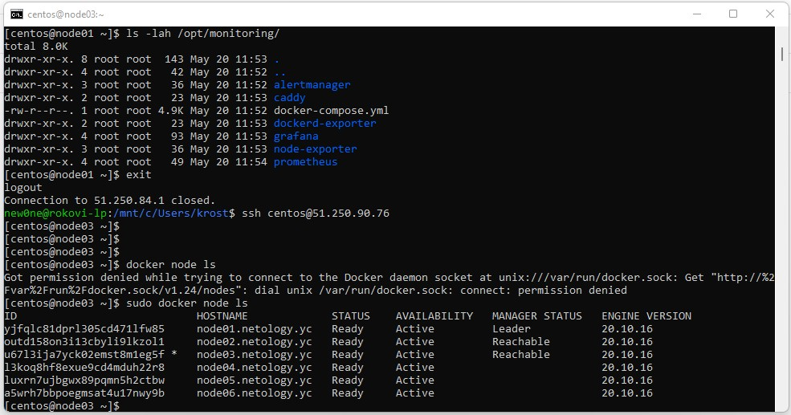
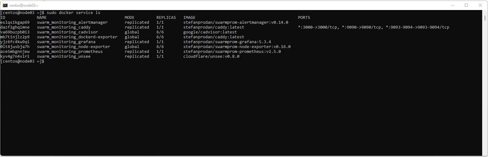

# Домашнее задание к занятию "5.5. Оркестрация кластером Docker контейнеров на примере Docker Swarm"

## Задача 1

Дайте письменые ответы на следующие вопросы:

- В чём отличие режимов работы сервисов в Docker Swarm кластере: replication и global?
> В случае с gloabal - сервис разворачивается на все ноды кластера. Актуально
> для мониторинга, антифируса и т.д.. В случае с replication - указывается кол-во
> экземпляров кторое необходимо развернуть.
- Какой алгоритм выбора лидера используется в Docker Swarm кластере?
> Используется алгоритм [Raft](https://raft.github.io/)
- Что такое Overlay Network?
> Overlay network - это сеть которая строиться поверх уже существующей сети. Узлы
> должны быть связаны логически или физически и\или могут иметь более одного маршрута и\или
> более одного физического соединения. Существует множестово протоколов 
> для построения overlay net, наприм. gre, vxlan и т.д..

## Задача 2

Создать ваш первый Docker Swarm кластер в Яндекс.Облаке

Для получения зачета, вам необходимо предоставить скриншот из терминала (консоли), с выводом команды:
```
[centos@node03 ~]$ sudo docker node ls
ID                            HOSTNAME             STATUS    AVAILABILITY   MANAGER STATUS   ENGINE VERSION
yjfqlc81dprl305cd471lfw85     node01.netology.yc   Ready     Active         Leader           20.10.16
outd158on3i13cbyli9lkzol1     node02.netology.yc   Ready     Active         Reachable        20.10.16
u67l3ija7yck02emst8m1eg5f *   node03.netology.yc   Ready     Active         Reachable        20.10.16
l3koq8hf8exue9cd4mduh22r8     node04.netology.yc   Ready     Active                          20.10.16
luxrn7ujbgwx89pqmn5h2ctbw     node05.netology.yc   Ready     Active                          20.10.16
a5wrh7bbpoegmsat4u17nwy9b     node06.netology.yc   Ready     Active                          20.10.16
```
<p align="center">
  
</p>
## Задача 3

Создать ваш первый, готовый к боевой эксплуатации кластер мониторинга, состоящий из стека микросервисов.

Для получения зачета, вам необходимо предоставить скриншот из терминала (консоли), с выводом команды:
```bash
[centos@node03 ~]$ sudo docker service ls
ID             NAME                                MODE         REPLICAS   IMAGE                                          PORTS
eslqs1kgap69   swarm_monitoring_alertmanager       replicated   1/1        stefanprodan/swarmprom-alertmanager:v0.14.0
dazf2ghqimne   swarm_monitoring_caddy              replicated   1/1        stefanprodan/caddy:latest                      *:3000->3000/tcp, *:9090->9090/tcp, *:9093-9094->9093-9094/tcp
va69buzpb0i3   swarm_monitoring_cadvisor           global       6/6        google/cadvisor:latest
mb7tinjlz2p9   swarm_monitoring_dockerd-exporter   global       6/6        stefanprodan/caddy:latest
yjz6fc4kw9qi   swarm_monitoring_grafana            replicated   1/1        stefanprodan/swarmprom-grafana:5.3.4
0lt4jusbja7h   swarm_monitoring_node-exporter      global       6/6        stefanprodan/swarmprom-node-exporter:v0.16.0
aze5mbgnnjew   swarm_monitoring_prometheus         replicated   1/1        stefanprodan/swarmprom-prometheus:v2.5.0
kyv4g7n4vlri   swarm_monitoring_unsee              replicated   1/1        cloudflare/unsee:v0.8.0
```
<p align="center">
  
</p>
## Задача 4 (*)

Выполнить на лидере Docker Swarm кластера команду (указанную ниже) и дать письменное описание её функционала, что она делает и зачем она нужна:
```bash
[centos@node01 ~]$ sudo docker swarm update --autolock=true
Swarm updated.
To unlock a swarm manager after it restarts, run the `docker swarm unlock`
command and provide the following key:

    SWMKEY-1-4v+K5tdiURaDSTTl8ncc9KMhTlIBrIbo/RJW+87kGNw

Please remember to store this key in a password manager, since without it you
will not be able to restart the manager.
[centos@node01 ~]$ sudo docker node ls
ID                            HOSTNAME             STATUS    AVAILABILITY   MANAGER STATUS   ENGINE VERSION
yjfqlc81dprl305cd471lfw85 *   node01.netology.yc   Ready     Active         Leader           20.10.16
outd158on3i13cbyli9lkzol1     node02.netology.yc   Ready     Active         Reachable        20.10.16
u67l3ija7yck02emst8m1eg5f     node03.netology.yc   Ready     Active         Reachable        20.10.16
l3koq8hf8exue9cd4mduh22r8     node04.netology.yc   Ready     Active                          20.10.16
luxrn7ujbgwx89pqmn5h2ctbw     node05.netology.yc   Ready     Active                          20.10.16
a5wrh7bbpoegmsat4u17nwy9b     node06.netology.yc   Ready     Active                          20.10.16
[centos@node01 ~]$ sudo systemctl restart docker
[centos@node01 ~]$ sudo docker node ls
Error response from daemon: Swarm is encrypted and needs to be unlocked before it can be used. Please use "docker swarm unlock" to unlock it.
[centos@node01 ~]$ sudo docker swarm unlock
Please enter unlock key:
[centos@node01 ~]$ sudo docker node ls
ID                            HOSTNAME             STATUS    AVAILABILITY   MANAGER STATUS   ENGINE VERSION
yjfqlc81dprl305cd471lfw85 *   node01.netology.yc   Ready     Active         Reachable        20.10.16
outd158on3i13cbyli9lkzol1     node02.netology.yc   Ready     Active         Reachable        20.10.16
u67l3ija7yck02emst8m1eg5f     node03.netology.yc   Ready     Active         Leader           20.10.16
l3koq8hf8exue9cd4mduh22r8     node04.netology.yc   Ready     Active                          20.10.16
luxrn7ujbgwx89pqmn5h2ctbw     node05.netology.yc   Ready     Active                          20.10.16
a5wrh7bbpoegmsat4u17nwy9b     node06.netology.yc   Ready     Active                          20.10.16
```
Данный функционал был введен вместе с функцией хранения секретов(конфиги, логины\пароли, сертификаты, ssh-ключи и т.д.)

Суть в том что Raft log(лог благодаря которому менеджеры синхранизируют
между собой изменения) хранится на диске в зашифрованном виде.
Защифрованный Raft log базируется на public\private ключах(/var/lib/docker/swarm/certificates/swarm-node.key) -
используется для рашсифровки log'а и коммуникациями между нодами.

В случае если менеджер скомпрометирован,(у атакующего будет доступ к этим ключам,
а значит и к секретам) при использовании `docker swarm update --autolock=true` public\private ключ
будут зашифрованны на офлайн ключи, который нужно запомнить и ввести вручную для разблокировки
менеджера.
