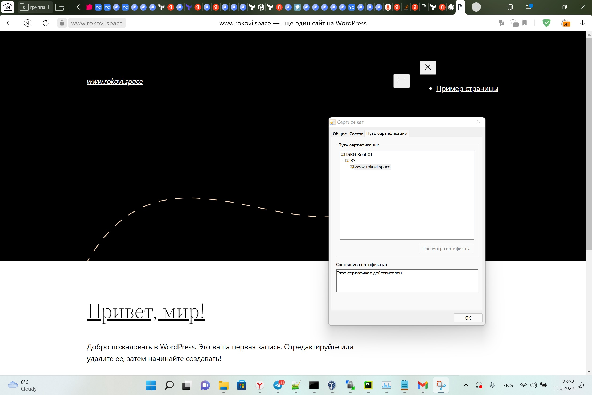

# Дипломный практикум в YandexCloud
  * [Цели:](#цели)
  * [Этапы выполнения:](#этапы-выполнения)
      * [Регистрация доменного имени](#регистрация-доменного-имени)
      * [Создание инфраструктуры](#создание-инфраструктуры)
          * [Установка Nginx и LetsEncrypt](#установка-nginx)
          * [Установка кластера MySQL](#установка-mysql)
          * [Установка WordPress](#установка-wordpress)
          * [Установка Gitlab CE, Gitlab Runner и настройка CI/CD](#установка-gitlab)
          * [Установка Prometheus, Alert Manager, Node Exporter и Grafana](#установка-prometheus)
  * [Что необходимо для сдачи задания?](#что-необходимо-для-сдачи-задания)
  * [Как правильно задавать вопросы дипломному руководителю?](#как-правильно-задавать-вопросы-дипломному-руководителю)

---
## Цели:

1. Зарегистрировать доменное имя (любое на ваш выбор в любой доменной зоне).
2. Подготовить инфраструктуру с помощью Terraform на базе облачного провайдера YandexCloud.
3. Настроить внешний Reverse Proxy на основе Nginx и LetsEncrypt.
4. Настроить кластер MySQL.
5. Установить WordPress.
6. Развернуть Gitlab CE и Gitlab Runner.
7. Настроить CI/CD для автоматического развёртывания приложения.
8. Настроить мониторинг инфраструктуры с помощью стека: Prometheus, Alert Manager и Grafana.

---
## Этапы выполнения:

### Регистрация доменного имени

Подойдет любое доменное имя на ваш выбор в любой доменной зоне.

ПРИМЕЧАНИЕ: Далее в качестве примера используется домен `you.domain` замените его вашим доменом.

Рекомендуемые регистраторы:
  - [nic.ru](https://nic.ru)
  - [reg.ru](https://reg.ru)

Цель:

1. Получить возможность выписывать [TLS сертификаты](https://letsencrypt.org) для веб-сервера.

Ожидаемые результаты:

1. У вас есть доступ к личному кабинету на сайте регистратора.
2. Вы зарезистрировали домен и можете им управлять (редактировать dns записи в рамках этого домена).
```
Зарегистрирован домен rokovi.space. Сделан трансфер зоны
на ns сервера YC, для дальнейшей настройки через terraform.
```

### Создание инфраструктуры

Для начала необходимо подготовить инфраструктуру в YC при помощи [Terraform](https://www.terraform.io/).

Особенности выполнения:

- Бюджет купона ограничен, что следует иметь в виду при проектировании инфраструктуры и использовании ресурсов;
- Следует использовать последнюю стабильную версию [Terraform](https://www.terraform.io/).

Предварительная подготовка:

1. Создайте сервисный аккаунт, который будет в дальнейшем использоваться Terraform для работы с инфраструктурой с необходимыми и достаточными правами. Не стоит использовать права суперпользователя

2. Подготовьте [backend](https://www.terraform.io/docs/language/settings/backends/index.html) для Terraform:
   а. Рекомендуемый вариант: [Terraform Cloud](https://app.terraform.io/)  
   б. Альтернативный вариант: S3 bucket в созданном YC аккаунте.
```
Использован вариант 'a', т.к. использую vpn.

Содержимое файла tf-cloud.tf. Перед этим через ЛК terraform cloud
была произведена дополнительная настройка.

terraform {
  cloud {
    organization = "rokovi-corp"

    workspaces {
      name = "stage"
    }
  }
}

```
3. Настройте [workspaces](https://www.terraform.io/docs/language/state/workspaces.html)
   а. Рекомендуемый вариант: создайте два workspace: *stage* и *prod*. В случае выбора этого варианта все последующие шаги должны учитывать факт существования нескольких workspace.  
   б. Альтернативный вариант: используйте один workspace, назвав его *stage*. Пожалуйста, не используйте workspace, создаваемый Terraform-ом по-умолчанию (*default*).
```bash
Использован вариант 'б'

new0ne@rokovi-lp:/mnt/d/2022/!EDUC/Netology/DevOps/HomeWorks/devops-netology_/devops-diplom-yandexcloud/terraform$ terraform workspace list
* stage

new0ne@rokovi-lp:/mnt/d/2022/!EDUC/Netology/DevOps/HomeWorks/devops-netology_/devops-diplom-yandexcloud/terraform$ terraform workspace show
stage
```
4. Создайте VPC с подсетями в разных зонах доступности.
5. Убедитесь, что теперь вы можете выполнить команды `terraform destroy` и `terraform apply` без дополнительных ручных действий.
6. В случае использования [Terraform Cloud](https://app.terraform.io/) в качестве [backend](https://www.terraform.io/docs/language/settings/backends/index.html) убедитесь, что применение изменений успешно проходит, используя web-интерфейс Terraform cloud.


Цель:

1. Повсеместно применять IaaC подход при организации (эксплуатации) инфраструктуры.
2. Иметь возможность быстро создавать (а также удалять) виртуальные машины и сети. С целью экономии денег на вашем аккаунте в YandexCloud.

Ожидаемые результаты:

1. Terraform сконфигурирован и создание инфраструктуры посредством Terraform возможно без дополнительных ручных действий.
2. Полученная конфигурация инфраструктуры является предварительной, поэтому в ходе дальнейшего выполнения задания возможны изменения.


[Тут](./terraform) находится код инфраструктуры terraform, за исключением
`key.json` для взаимодействия с YC, т.к. это приватные данные.

В конце выполнения terraform создает файл inventory в каталоге c [ansible](./ansible) и запускает 
[yc-diplom-done.yml](./ansible/yc-diplom-done.yml)

---
### Установка Nginx и LetsEncrypt

Необходимо разработать Ansible роль для установки Nginx и LetsEncrypt.

**Для получения LetsEncrypt сертификатов во время тестов своего кода пользуйтесь [тестовыми сертификатами](https://letsencrypt.org/docs/staging-environment/), так как количество запросов к боевым серверам LetsEncrypt [лимитировано](https://letsencrypt.org/docs/rate-limits/).**

Рекомендации:
  - Имя сервера: `you.domain`
  - Характеристики: 2vCPU, 2 RAM, External address (Public) и Internal address.

Цель:

1. Создать reverse proxy с поддержкой TLS для обеспечения безопасного доступа к веб-сервисам по HTTPS.

Ожидаемые результаты:

1. В вашей доменной зоне настроены все A-записи на внешний адрес этого сервера:
    - `https://www.you.domain` (WordPress)
    - `https://gitlab.you.domain` (Gitlab)
    - `https://grafana.you.domain` (Grafana)
    - `https://prometheus.you.domain` (Prometheus)
    - `https://alertmanager.you.domain` (Alert Manager)
2. Настроены все upstream для выше указанных URL, куда они сейчас ведут на этом шаге не важно, позже вы их отредактируете и укажите верные значения.
2. В браузере можно открыть любой из этих URL и увидеть ответ сервера (502 Bad Gateway). На текущем этапе выполнение задания это нормально!


###### За развертывание reverse-proxy Nginx и генерацию сертификатов, отвечает роль [nginx](./ansible/roles/nginx/tasks/main.yml)
___
### Установка кластера MySQL

Необходимо разработать Ansible роль для установки кластера MySQL.

Рекомендации:
  - Имена серверов: `db01.you.domain` и `db02.you.domain`
  - Характеристики: 4vCPU, 4 RAM, Internal address.

Цель:

1. Получить отказоустойчивый кластер баз данных MySQL.

Ожидаемые результаты:

1. MySQL работает в режиме репликации Master/Slave.
2. В кластере автоматически создаётся база данных c именем `wordpress`.
3. В кластере автоматически создаётся пользователь `wordpress` с полными правами на базу `wordpress` и паролем `wordpress`.

**Вы должны понимать, что в рамках обучения это допустимые значения, но в боевой среде использование подобных значений не приемлимо! Считается хорошей практикой использовать логины и пароли повышенного уровня сложности. В которых будут содержаться буквы верхнего и нижнего регистров, цифры, а также специальные символы!**


###### За создание master и slave сервера отвечает роль [mysql](./ansible/roles/mysql/tasks/main.yml)
###### Переменные роли вынесены в ansible [playbook](./yc-diplom-done.yml)

___
### Установка WordPress

Необходимо разработать Ansible роль для установки WordPress.

Рекомендации:
  - Имя сервера: `app.you.domain`
  - Характеристики: 4vCPU, 4 RAM, Internal address.

Цель:

1. Установить [WordPress](https://wordpress.org/download/). Это система управления содержимым сайта ([CMS](https://ru.wikipedia.org/wiki/Система_управления_содержимым)) с открытым исходным кодом.


По данным W3techs, WordPress используют 64,7% всех веб-сайтов, которые сделаны на CMS. Это 41,1% всех существующих в мире сайтов. Эту платформу для своих блогов используют The New York Times и Forbes. Такую популярность WordPress получил за удобство интерфейса и большие возможности.

Ожидаемые результаты:

1. Виртуальная машина на которой установлен WordPress и Nginx/Apache (на ваше усмотрение).
```
Был выбран вариантс Nginx, дабы не городить ПО, nginx мы использовали ранее
на этапе развертывани reverse-proxy.
```
2. В вашей доменной зоне настроена A-запись на внешний адрес reverse proxy:
    - `https://www.you.domain` (WordPress)
```
A-записи создаются при помощи terraform, т.к. ранее был
сделан трансфер зоны на сервера YC.

Создание самой зоны описано в network.tf:

#DNS
resource "yandex_dns_zone" "zone1" {
  name        = "public-zone"
  description = "My first yc public zone"

  labels = {
    label1 = "public"
  }

  zone   = "rokovi.space."
  public = true
}

Создание А-записей описано в файле(proxy.rokovi.space.tf) создания ВМ с reverse-proxy:

resource "yandex_dns_recordset" "rs1" {
  zone_id = yandex_dns_zone.zone1.id
  name    = "www.rokovi.space."
  type    = "A"
  ttl     = 200
  data    = [yandex_compute_instance.proxy.network_interface.0.nat_ip_address]
}

resource "yandex_dns_recordset" "rs2" {
  zone_id = yandex_dns_zone.zone1.id
  name    = "gitlab.rokovi.space."
  type    = "A"
  ttl     = 200
  data    = [yandex_compute_instance.proxy.network_interface.0.nat_ip_address]
}

resource "yandex_dns_recordset" "rs3" {
  zone_id = yandex_dns_zone.zone1.id
  name    = "grafana.rokovi.space."
  type    = "A"
  ttl     = 200
  data    = [yandex_compute_instance.proxy.network_interface.0.nat_ip_address]
}

resource "yandex_dns_recordset" "rs4" {
  zone_id = yandex_dns_zone.zone1.id
  name    = "prometheus.rokovi.space."
  type    = "A"
  ttl     = 200
  data    = [yandex_compute_instance.proxy.network_interface.0.nat_ip_address]
}

resource "yandex_dns_recordset" "rs5" {
  zone_id = yandex_dns_zone.zone1.id
  name    = "alertmanager.rokovi.space."
  type    = "A"
  ttl     = 200
  data    = [yandex_compute_instance.proxy.network_interface.0.nat_ip_address]
}
```
3. На сервере `you.domain` отредактирован upstream для выше указанного URL и он смотрит на виртуальную машину на которой установлен WordPress.
4. В браузере можно открыть URL `https://www.you.domain` и увидеть главную страницу WordPress.
---


###### За развертывание CMS отвечает роль [wordpress](./ansible/roles/wordpress/tasks/main.yml)
###### Для работы c mysql в режиме master-slave был взят plugin [HyperDB](https://wordpress.org/plugins/hyperdb/)
### Установка Gitlab CE и Gitlab Runner

Необходимо настроить CI/CD систему для автоматического развертывания приложения при изменении кода.

Рекомендации:
  - Имена серверов: `gitlab.you.domain` и `runner.you.domain`
  - Характеристики: 4vCPU, 4 RAM, Internal address.

Цель:
1. Построить pipeline доставки кода в среду эксплуатации, то есть настроить автоматический деплой на сервер `app.you.domain` при коммите в репозиторий с WordPress.

Подробнее об [Gitlab CI](https://about.gitlab.com/stages-devops-lifecycle/continuous-integration/)

Ожидаемый результат:

1. Интерфейс Gitlab доступен по https.

2. В вашей доменной зоне настроена A-запись на внешний адрес reverse proxy:
    - `https://gitlab.you.domain` (Gitlab)
```
Все A-записи создаются на этапе создания ВМ с reverse-proxy
в файле proxy.rokovi.space.tf
```
3. На сервере `you.domain` отредактирован upstream для выше указанного URL и он смотрит на виртуальную машину на которой установлен Gitlab.
4. При любом коммите в репозиторий с WordPress и создании тега (например, v1.0.0) происходит деплой на виртуальную машину.
```
После развертывания через Ansible: 
https://gitlab.rokovi.space
login: root
pass: Netologyrokov1
gl_token: rokovirunner
```
```
Регистрация runner'a происходит автоматически через роль:
```

```
Далее, создадим проект:
```


```
Добавим закрытый ключ(созданный на этапе развертывания ВМ с помощью terraform) в переменную в Gitlab:

```


```
Идем на app.rokovi.space, инициализируем и подключаем ранее созданный репозиторий:

sudo git init
sudo git config --global --add safe.directory /var/www/wordpress
sudo git remote add origin http://192.168.178.11/gitlab-instance-ac85c8f3/wordpress.git
sudo git add -A
sudo git commit -m "Init commit"
sudo git push -u origin master
```

```
Создадим следующий pipeline, согласно условию:
---
before_script:
  - eval $(ssh-agent -s)
  - ssh-add <(echo "$SSH_KEY")


stages:
  - deploy

deploy-job:
  stage: deploy
  tags: 
    - netology
  rules:
    - if: $CI_COMMIT_TAG
  script:
    - echo "Deploy app"
    - ssh -o StrictHostKeyChecking=no rokovi@192.168.178.9 sudo chown rokovi /var/www/wordpress/ -R
    - rsync -vz -e "ssh -o StrictHostKeyChecking=no" ./* rokovi@192.168.178.9:/var/www/wordpress/
    - ssh -o StrictHostKeyChecking=no rokovi@192.168.178.9 sudo chown www-data /var/www/wordpress/ -R
```

```
В репозитории wordpress cоздадим info.php со следующим содержимым:

<?php phpinfo(); ?>

Добавим тег, после чего отработает deploy-job:

```


```
Проверяем:
```


###### За развертывание Gitlab отвечает роль [gitlabee](./ansible/roles/gitlab_ee/tasks/main.yml)
```
Роль gitlab_ee была написана с испоьзованием Gitlab docker img'a, т.к. попытки установить
с помощью скрипта с официального сайта получают отлуп по региональному признаку.  
```
###### За развертывание Gitlab отвечает роль [gitlab_runner](./ansible/roles/gitlab_runner/tasks/main.yml)
___
### Установка Prometheus, Alert Manager, Node Exporter и Grafana

Необходимо разработать Ansible роль для установки Prometheus, Alert Manager и Grafana.

Рекомендации:
  - Имя сервера: `monitoring.you.domain`
  - Характеристики: 4vCPU, 4 RAM, Internal address.

Цель:

1. Получение метрик со всей инфраструктуры.

Ожидаемые результаты:

1. Интерфейсы Prometheus, Alert Manager и Grafana доступены по https.


2. В вашей доменной зоне настроены A-записи на внешний адрес reverse proxy:
  - `https://grafana.you.domain` (Grafana)
  - `https://prometheus.you.domain` (Prometheus)
  - `https://alertmanager.you.domain` (Alert Manager)
```
Все A-записи создаются на этапе создания ВМ с reverse-proxy
в файле proxy.rokovi.space.tf
```
3. На сервере `you.domain` отредактированы upstreams для выше указанных URL и они смотрят на виртуальную машину на которой установлены Prometheus, Alert Manager и Grafana.
4. На всех серверах установлен Node Exporter и его метрики доступны Prometheus.
```
На скриншоте Prometheus(выше) видно все источники метрик, на которых
установлен Node Exporter.
IP-адреса берутся во время развертывания роли prometheus в цикле из файла inventory, который создает terraform:

- job_name: 'nodes'
    scrape_interval: 5s
    static_configs:
      - targets:
    
      - '{{ host }}:9100'
    
```
5. У Alert Manager есть необходимый [набор правил](./ansible/roles/alertmanager/files/alertmanager.yml) для создания алертов.
6. В Grafana есть [дашборд](./ansible/roles/grafana/files/dashboards) отображающий метрики из Node Exporter по всем серверам.
7. В Grafana есть дашборд отображающий метрики из MySQL (*).
8. В Grafana есть дашборд отображающий метрики из WordPress (*).

*Примечание: дашборды со звёздочкой являются опциональными заданиями повышенной сложности их выполнение желательно, но не обязательно.*

###### За развертывание Node Exporter отвечает роль [node_exporter](./ansible/roles/node_exporter/tasks/main.yml)
###### За развертывание Prometheus отвечает роль [prometheus](./ansible/roles/prometheus/tasks/main.yml)
###### За развертывание Alert Manager отвечает роль [alertmanager](./ansible/roles/alertmanager/tasks/main.yml)
###### За развертывание Grafana отвечает роль [grafana](./ansible/roles/grafana/tasks/main.yml)

Вывод работы [playbook'a](./ansible/yc-diplom-done.yml) ansible:

---
## Что необходимо для сдачи задания?

1. Репозиторий со всеми Terraform манифестами и готовность продемонстрировать создание всех ресурсов с нуля.
2. Репозиторий со всеми Ansible ролями и готовность продемонстрировать установку всех сервисов с нуля.
3. Скриншоты веб-интерфейсов всех сервисов работающих по HTTPS на вашем доменном имени.
  - `https://www.you.domain` (WordPress)
  - `https://gitlab.you.domain` (Gitlab)
  - `https://grafana.you.domain` (Grafana)
  - `https://prometheus.you.domain` (Prometheus)
  - `https://alertmanager.you.domain` (Alert Manager)
4. Все репозитории рекомендуется хранить на одном из ресурсов ([github.com](https://github.com) или [gitlab.com](https://gitlab.com)).

---
## Как правильно задавать вопросы дипломному руководителю?

**Что поможет решить большинство частых проблем:**

1. Попробовать найти ответ сначала самостоятельно в интернете или в
  материалах курса и ДЗ и только после этого спрашивать у дипломного
  руководителя. Навык поиска ответов пригодится вам в профессиональной
  деятельности.
2. Если вопросов больше одного, то присылайте их в виде нумерованного
  списка. Так дипломному руководителю будет проще отвечать на каждый из
  них.
3. При необходимости прикрепите к вопросу скриншоты и стрелочкой
  покажите, где не получается.

**Что может стать источником проблем:**

1. Вопросы вида «Ничего не работает. Не запускается. Всё сломалось». Дипломный руководитель не сможет ответить на такой вопрос без дополнительных уточнений. Цените своё время и время других.
2. Откладывание выполнения курсового проекта на последний момент.
3. Ожидание моментального ответа на свой вопрос. Дипломные руководители работающие разработчики, которые занимаются, кроме преподавания, своими проектами. Их время ограничено, поэтому постарайтесь задавать правильные вопросы, чтобы получать быстрые ответы :)
