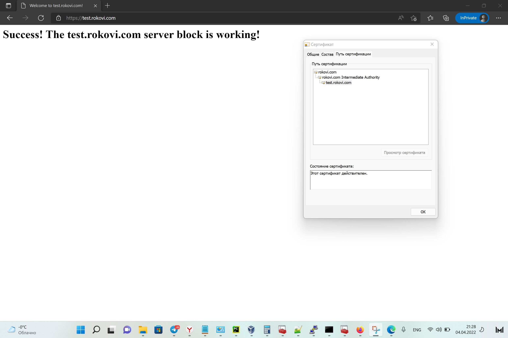
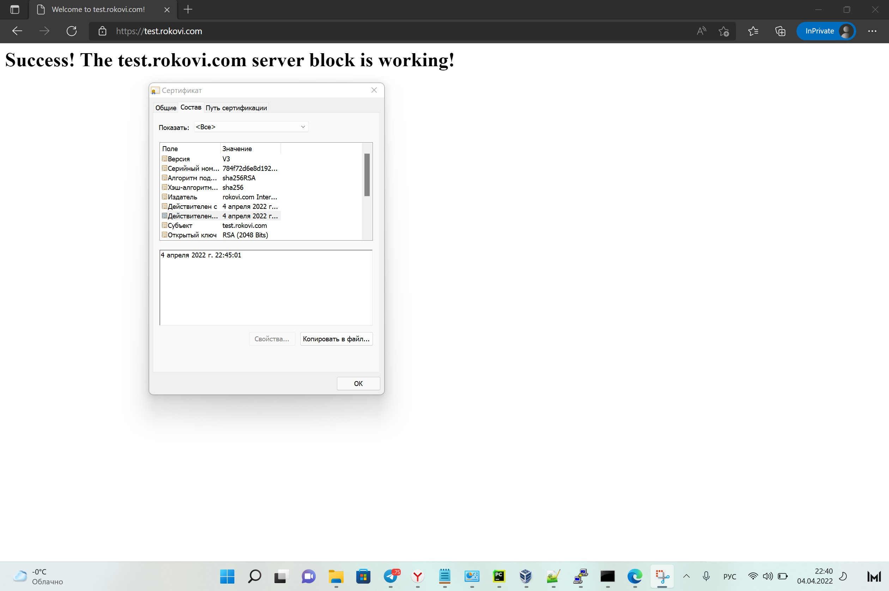
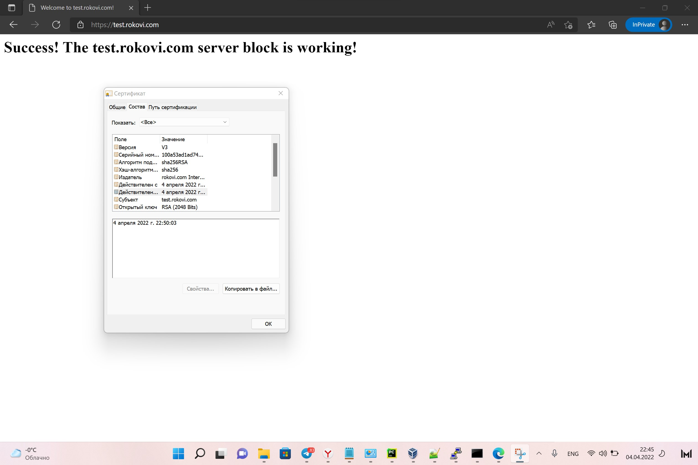
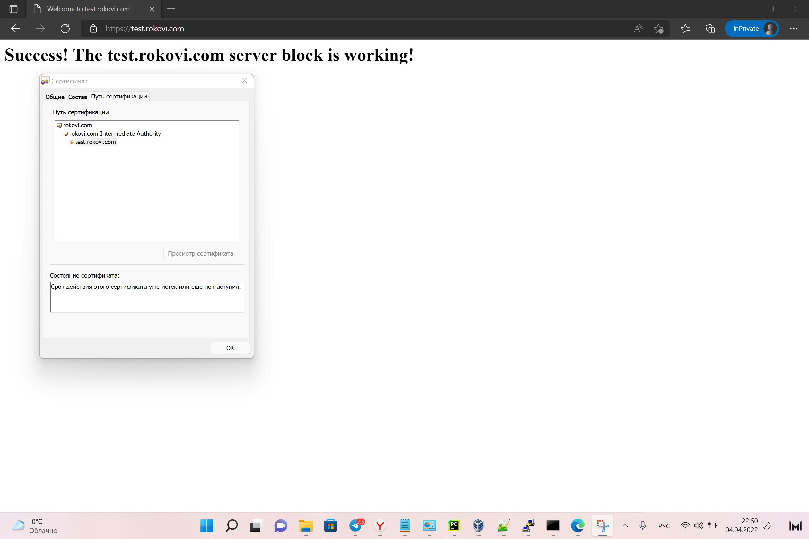

# Курсовая работа по итогам модуля "DevOps и системное администрирование"

***Задания выполнялись на bento/ubuntu-20.04***

### 1. Установка и настройка ufw:
`ufw` - в ubuntu 20.04 lts установлен по умолчанию, но не активирован. 

Установка:
```bash
#Для установки ufw
sudo apt install ufw
#Запускаем ufw
sudo systemctl start ufw
#Добавляем в автозагрузку
sudo systemctl enable ufw
```
В `ufw` существуют настройки по умолчанию которые распологаются по пути `/etc/default/ufw`
```bash
vagrant@vagrant:~/testssl.sh$ cat /etc/default/ufw
# /etc/default/ufw
#

# Set to yes to apply rules to support IPv6 (no means only IPv6 on loopback
# accepted). You will need to 'disable' and then 'enable' the firewall for
# the changes to take affect.
IPV6=yes

# Set the default input policy to ACCEPT, DROP, or REJECT. Please note that if
# you change this you will most likely want to adjust your rules.
DEFAULT_INPUT_POLICY="DROP"

# Set the default output policy to ACCEPT, DROP, or REJECT. Please note that if
# you change this you will most likely want to adjust your rules.
DEFAULT_OUTPUT_POLICY="ACCEPT"

# Set the default forward policy to ACCEPT, DROP or REJECT.  Please note that
# if you change this you will most likely want to adjust your rules
DEFAULT_FORWARD_POLICY="DROP"

# Set the default application policy to ACCEPT, DROP, REJECT or SKIP. Please
# note that setting this to ACCEPT may be a security risk. See 'man ufw' for
# details
DEFAULT_APPLICATION_POLICY="SKIP"

# By default, ufw only touches its own chains. Set this to 'yes' to have ufw
# manage the built-in chains too. Warning: setting this to 'yes' will break
# non-ufw managed firewall rules
MANAGE_BUILTINS=no

#
# IPT backend
#
# only enable if using iptables backend
IPT_SYSCTL=/etc/ufw/sysctl.conf

# Extra connection tracking modules to load. IPT_MODULES should typically be
# empty for new installations and modules added only as needed. See
# 'CONNECTION HELPERS' from 'man ufw-framework' for details. Complete list can
# be found in net/netfilter/Kconfig of your kernel source. Some common modules:
# nf_conntrack_irc, nf_nat_irc: DCC (Direct Client to Client) support
# nf_conntrack_netbios_ns: NetBIOS (samba) client support
# nf_conntrack_pptp, nf_nat_pptp: PPTP over stateful firewall/NAT
# nf_conntrack_ftp, nf_nat_ftp: active FTP support
# nf_conntrack_tftp, nf_nat_tftp: TFTP support (server side)
# nf_conntrack_sane: sane support
IPT_MODULES=""
vagrant@vagrant:~/testssl.sh$
```
Цепочка `input` при активации `ufw` запретит все входящие соединения(по умолчанию DEFAULT_INPUT_POLICY="DROP"), поэтому
добавим необходимые сервисы:
```bash
vagrant@vagrant:~/testssl.sh$ sudo ufw allow ssh
Rules updated
Rules updated (v6)
vagrant@vagrant:~/testssl.sh$ sudo ufw allow https
Rules updated
Rules updated (v6)
vagrant@vagrant:~/testssl.sh$ sudo ufw status
Status: inactive
#Активируем ufw
vagrant@vagrant:~/testssl.sh$ sudo ufw enable
Command may disrupt existing ssh connections. Proceed with operation (y|n)? y
Firewall is active and enabled on system startup
vagrant@vagrant:~/testssl.sh$ sudo ufw status numbered
Status: active

To                         Action      From
--                         ------      ----
22/tcp                     ALLOW       Anywhere
443/tcp                    ALLOW       Anywhere
22/tcp (v6)                ALLOW       Anywhere (v6)
443/tcp (v6)               ALLOW       Anywhere (v6)

#v6 - это правила для IPv6-трафика
```

### 2. Установка и выпуск сертификатов с помощью hashicorp vault:

***В связи с блокировками и пока еще не развернутым VPN,
был использован `manual` режим установки vault***

Для установки можно скачать уже готовый бинарный файл под свой тип ОС
и архитектууру. Можно взять [здесь](https://hashicorp-releases.website.yandexcloud.net/vault/1.9.3/)

Установка:
```bash
vagrant@vagrant:~$ sudo -s
#Обновим пакетную базу
root@vagrant:/home/vagrant# apt update
#Установим пакет unzip для распаковки vault
root@vagrant:/home/vagrant# apt install unzip
#Установим обработчик jq для json(jq is like sed for JSON data)
root@vagrant:/home/vagrant# apt install
#Проверим архитектуру
root@vagrant:/home/vagrant# dpkg --print-architecture
amd64
#Скачаем необходимый архив
root@vagrant:/home/vagrant# wget https://hashicorp-releases.website.yandexcloud.net/vault/1.9.3/vault_1.9.3_linux_amd64.zip
--2022-04-03 06:00:00--  https://hashicorp-releases.website.yandexcloud.net/vault/1.9.3/vault_1.9.3_linux_amd64.zip
Resolving hashicorp-releases.website.yandexcloud.net (hashicorp-releases.website.yandexcloud.net)... 213.180.193.247, 2a02:6b8::1da
Connecting to hashicorp-releases.website.yandexcloud.net (hashicorp-releases.website.yandexcloud.net)|213.180.193.247|:443... connected.
HTTP request sent, awaiting response... 200 OK
Length: 68962699 (66M) [application/zip]
Saving to: ‘vault_1.9.3_linux_amd64.zip’

vault_1.9.3_linux_amd64.zip   100%[=================================================>]  65.77M  4.18MB/s    in 16s

Last-modified header invalid -- time-stamp ignored.
2022-04-03 06:00:17 (4.03 MB/s) - ‘vault_1.9.3_linux_amd64.zip’ saved [68962699/68962699]
#Распакуем архив по пути который существует в переменной $PATH
root@vagrant:/home/vagrant# unzip -d /usr/bin/ vault_1.9.3_linux_amd64.zip
Archive:  vault_1.9.3_linux_amd64.zip
  inflating: /usr/bin/vault
root@vagrant:/home/vagrant# ll /usr/bin/ | grep vau
-rwxr-xr-x  1 root   root    187665656 Jan 24 22:18 vault*
#Запустим vault в dev-режиме(The dev server is a built-in, pre-configured server that is not very secure but useful for playing with Vault locally)
root@vagrant:/home/vagrant# vault server -dev -dev-root-token-id root

WARNING! dev mode is enabled! In this mode, Vault runs entirely in-memory
and starts unsealed with a single unseal key. The root token is already
authenticated to the CLI, so you can immediately begin using Vault.

You may need to set the following environment variable:

    $ export VAULT_ADDR='http://127.0.0.1:8200'

The unseal key and root token are displayed below in case you want to
seal/unseal the Vault or re-authenticate.

Unseal Key: 4YiSY33Ky9JR0i0FlFx90BvFVEcR0B4kng18SbXEwaE=
Root Token: root

Development mode should NOT be used in production installations!

#В новом терминале добавляем переменные для работы с vault(из output'a запуска vault на предыдущем шаге)
root@vagrant:/home/vagrant# export VAULT_ADDR=http://127.0.0.1:8200
root@vagrant:/home/vagrant# export VAULT_TOKEN=root
#Проверим
root@vagrant:/home/vagrant# export | grep VA
declare -x VAULT_ADDR="http://127.0.0.1:8200"
declare -x VAULT_TOKEN="root"
root@vagrant:/home/vagrant# vault status
Key             Value
---             -----
Seal Type       shamir
Initialized     true
Sealed          false
Total Shares    1
Threshold       1
Version         1.9.3
Storage Type    inmem
Cluster Name    vault-cluster-a1f153cd
Cluster ID      463e47e8-f547-d420-8a7e-93c864e14888
HA Enabled      false

```
Выпуск сертификатов:
```bash
###==Выпуск CA==###
#Активируем движок pki
root@vagrant:/home/vagrant# vault secrets enable pki
Success! Enabled the pki secrets engine at: pki/
#Настроим TTL сертификата
root@vagrant:/home/vagrant# vault secrets tune -max-lease-ttl=87600h pki
Success! Tuned the secrets engine at: pki/
# Создаем свой self-signed CA
root@vagrant:/home/vagrant# vault write -field=certificate pki/root/generate/internal \
     common_name="rokovi.com" \
     ttl=87600h > CA_cert.crt
#Задаем расположение CA and CRL.
root@vagrant:/home/vagrant# vault write pki/config/urls \
      issuing_certificates="$VAULT_ADDR/v1/pki/ca" \
      crl_distribution_points="$VAULT_ADDR/v1/pki/crl"
Success! Data written to: pki/config/urls
###==Выпуск int-CA==###
#Активируем движок pki-int
root@vagrant:/home/vagrant# vault secrets enable -path=pki_int pki
Success! Enabled the pki secrets engine at: pki_int/
#Настроим TTL сертификата
root@vagrant:/home/vagrant# vault secrets tune -max-lease-ttl=43800h pki_int
Success! Tuned the secrets engine at: pki_int/
#Генерируем int-CA и создаем CSR-запрос
root@vagrant:/home/vagrant# vault write -format=json pki_int/intermediate/generate/internal \
      common_name="rokovi.com Intermediate Authority" \
      | jq -r '.data.csr' > pki_intermediate.csr
#Подписываем и сохраняем int-CA
root@vagrant:/home/vagrant# vault write -format=json pki/root/sign-intermediate csr=@pki_intermediate.csr \
      format=pem_bundle ttl="43800h" \
      | jq -r '.data.certificate' > intermediate.cert.pem
#Импортируем подписанный int-CA в vault
root@vagrant:/home/vagrant# vault write pki_int/intermediate/set-signed certificate=@intermediate.cert.pem
Success! Data written to: pki_int/intermediate/set-signed
#Создаем роль для выдачи сертификатов 
root@vagrant:/home/vagrant# vault write pki_int/roles/rokovi-dot-com \
     allowed_domains="rokovi.com" \
     allow_subdomains=true \
     max_ttl="168h"
#Добавим CA в хранилище корневых сертификатов на хостовой машине
root@vagrant:/home/vagrant# cp CA_cert.crt /vagrant/
powershell "Import-Certificate -FilePath "D:\2022\!EDUC\Netology\DevOps\Vagrant\CA_cert.crt" -CertStoreLocation cert:\CurrentUser\Root"
#Выпускаем серверный сертификат
vault write -format=json pki_int/issue/rokovi-dot-com common_name="test.rokovi.com" ttl="30m" > test.rokovi.com.crt
cat test.rokovi.com.crt | jq -r .data.certificate > /etc/nginx/sites-available/certs/test.rokovi.com/test.rokovi.com.pem
cat test.rokovi.com.crt | jq -r .data.issuing_ca >> /etc/nginx/sites-available/certs/test.rokovi.com/test.rokovi.com.pem
cat test.rokovi.com.crt | jq -r .data.private_key > /etc/nginx/sites-available/certs/test.rokovi.com/test.rokovi.com.key
```
### 3. Установка и настройка nginx:
Установка:
```bash
root@vagrant:/home/vagrant# apt install nginx
#Проверим
root@vagrant:/home/vagrant# systemctl status nginx
● nginx.service - A high performance web server and a reverse proxy server
     Loaded: loaded (/lib/systemd/system/nginx.service; enabled; vendor preset: enable>
     Active: active (running) since Sun 2022-04-03 10:16:55 UTC; 44s ago
       Docs: man:nginx(8)
   Main PID: 2509 (nginx)
      Tasks: 5 (limit: 2278)
     Memory: 7.0M
     CGroup: /system.slice/nginx.service
             ├─2509 nginx: master process /usr/sbin/nginx -g daemon on; master_process>
             ├─2510 nginx: worker process
             ├─2511 nginx: worker process
             ├─2512 nginx: worker process
             └─2513 nginx: worker process

Apr 03 10:16:55 vagrant systemd[1]: Starting A high performance web server and a rever>
Apr 03 10:16:55 vagrant systemd[1]: Started A high performance web server and a revers>

```
Настройка:
```bash
#Создадим отдельную директорию для нашего домена
root@vagrant:/home/vagrant# mkdir -p /var/www/test.rokovi.com/html
#Назначим корректные права
root@vagrant:/home/vagrant# chmod -R 755 /var/www/test.rokovi.com
#Создадим index.html с произвольным содержимым
root@vagrant:/home/vagrant# nano /var/www/test.rokovi.com/html/index.html
#Создадим директорию для хранения сертификатов
mkdir -p /etc/nginx/sites-available/certs/test.rokovi.com
chown -R :www-data /etc/nginx/sites-available/certs/
chmod 640 -R /etc/nginx/sites-available/certs/
#Создадим файл конфигурации данного сабдомена
root@vagrant:/home/vagrant# nano /etc/nginx/sites-available/test.rokovi.com
server {
        listen 443 ssl;

        root /var/www/test.rokovi.com/html;
        index index.html index.htm index.nginx-debian.html;

        server_name test.rokovi.com;
        ssl_certificate /etc/nginx/sites-available/certs/test.rokovi.com/test.rokovi.com.crt
        ssl_certificate_key /etc/nginx/sites-available/certs/test.rokovi.com/test.rokovi.com.key
        ssl_protocols           TLSv1 TLSv1.1 TLSv1.2;
        ssl_ciphers             HIGH:!aNULL:!MD5;

        location / {
                try_files $uri $uri/ =404;
        }
}
#Активируем файл
root@vagrant:/home/vagrant# ln -s /etc/nginx/sites-available/test.rokovi.com /etc/nginx/sites-enabled/
#Перезагружаем службу
root@vagrant:/home/vagrant# systemctl restart nginx
```
### 3. Страница сервера nginx:



### 4. Скрипт генерации нового сертификата:

```bash
#!/usr/bin/env bash

export VAULT_ADDR="http://127.0.0.1:8200"
export VAULT_TOKEN="root"

vault write -format=json pki_int/issue/rokovi-dot-com common_name="test.rokovi.com" ttl="5m" > test.rokovi.com.crt
cat test.rokovi.com.crt | jq -r .data.certificate > /etc/nginx/sites-available/certs/test.rokovi.com/test.rokovi.com.pem
cat test.rokovi.com.crt | jq -r .data.issuing_ca >> /etc/nginx/sites-available/certs/test.rokovi.com/test.rokovi.com.pem
cat test.rokovi.com.crt | jq -r .data.private_key > /etc/nginx/sites-available/certs/test.rokovi.com/test.rokovi.com.key
chown -R :www-data /etc/nginx/sites-available/certs/
chmod 640 -R /etc/nginx/sites-available/certs/
systemctl reload nginx
```


### 5. Работа crontab:
***Задача отрабатывает каждые 5 минут***





Задача в cron отключена:

